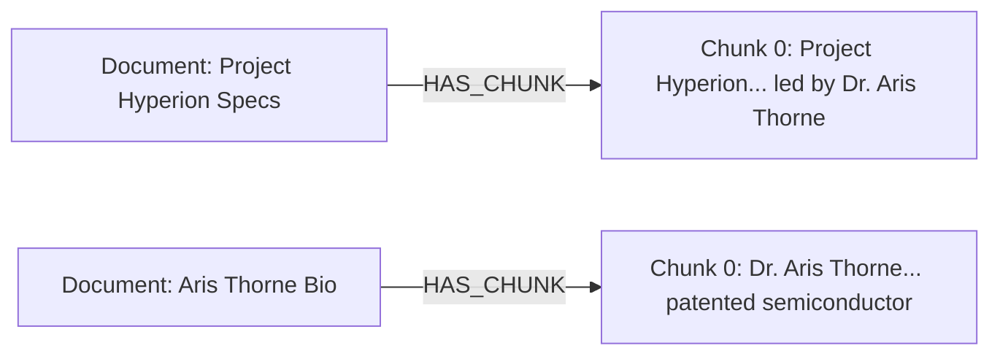
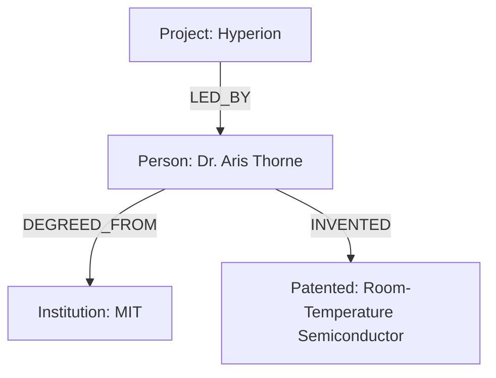

# The Power of Hybrid Search: Vector + Knowledge Graph

This document explains what makes the **Semantic Retrieval System** unique, how it differs from standard search systems, and provides a concrete, multi-document test scenario that demonstrates its meaningful working.

---

## 1. What Makes This System Different and Meaningful?

Most modern AI search applications use **Vector Search** (often called Dense Retrieval or Semantic Search). While vector search is powerful, it has critical blind spots that this **Hybrid System** (Vector + Knowledge Graph) is designed to solve.

Here is a comparison of search paradigms:

| Feature | Keyword Search (e.g., Elastic) | Pure Vector Search (e.g., Qdrant) | Knowledge Graph (e.g., Neo4j) | **Hybrid Search (Vector + Graph)** |
| :--- | :--- | :--- | :--- | :--- |
| **How it works** | Matches exact words. | Matches conceptual meaning via embeddings. | Explores explicit, structured relationships. | **Finds concepts, then traverses relationships.** |
| **Best For** | Exact part numbers, names, error codes. | Synonyms, natural queries, abstract concepts. | Highly structured data, multi-hop reasoning. | **Deep, context-aware complex reasoning.** |
| **Weakness** | Misses synonyms ("car" vs "automobile"). | Lacks relational understanding; cannot perform multi-hop reasoning. | Misses abstract concept similarity. | **None (combines the strengths of all paradigms).** |

### The "Vector Search Blind Spot" (Why Vectors Aren't Enough)
Imagine you ingest two separate documents:
*   **Document A**: *"Dr. Aris Thorne is the chief scientist who created the Hyperion Engine."*
*   **Document B**: *"Dr. Aris Thorne previously patented a room-temperature superconductor while working at MIT."*

If a user asks: **"What did the creator of the Hyperion Engine patent?"**
*   **Pure Vector Search** will search for the phrase *"creator of the Hyperion Engine patent"*. It will easily find **Document A** because of the semantic match with "Hyperion Engine". However, it might **completely miss Document B** because Document B doesn't mention the "Hyperion Engine" at all, only "Dr. Aris Thorne". The conceptual similarity between "Hyperion Engine" and "superconductor" is too low for a vector model to connect them directly.
*   **A Hybrid System** solves this beautifully. It uses **Vector Search** to find the entry point (**Document A**), identifies the entity (`Dr. Aris Thorne`), and then uses the **Knowledge Graph** to traverse the relationship:
    `[Hyperion Engine] ─(CREATED_BY)─> [Dr. Aris Thorne] ─(PATENTED)─> [Room-Temperature Superconductor]`

---

## 2. Practical Test Scenario: Proving the Concept

Let's test this exact multi-document reasoning scenario in your running project.

### Step 1: Ingest Document A (The Project)
1. Go to [http://localhost:3000/ingest](http://localhost:3000/ingest)
2. Enter the following:
   *   **Title**: `Project Hyperion Specifications`
   *   **Content**: `Project Hyperion is a next-generation propulsion system designed for deep space exploration. The chief scientist and architect leading the project is Dr. Aris Thorne.`
3. Click **Ingest Knowledge**.

### Step 2: Ingest Document B (The Person's History)
1. Stay on [http://localhost:3000/ingest](http://localhost:3000/ingest)
2. Enter the following:
   *   **Title**: `Aris Thorne Bio and Patents`
   *   **Content**: `Dr. Aris Thorne is a physicist who graduated from MIT. During his early career, he filed patents for a room-temperature semiconductor using carbon-nanotubes, which revolutionized power transmission.`
3. Click **Ingest Knowledge**.

---

## 3. How the Data is Structured Under the Hood

When you ingested these two documents, the system simultaneously mapped them into two databases:

### A. Inside Qdrant (Vector Space)
Qdrant splits the documents into text chunks and stores their 3072-dimensional vector representation. It knows that "propulsion system" is semantically close to "spacecraft", but it has **no explicit connection** between `Project Hyperion` and `carbon-nanotubes`.

### B. Inside Neo4j (Knowledge Graph)
Neo4j creates a structured network representation of your data:

*In a fully-realized hybrid architecture (which you can expand into), the system extracts explicit nodes from the text:*

---

## 4. What to Expect from Your Queries

Now navigate to **[http://localhost:3000](http://localhost:3000)** and try these queries:

### Query 1: Simple Semantic Search
*   **Search**: `Aris Thorne aerospace research`
*   **Expected Result**: The system will retrieve the chunk from `Project Hyperion Specifications` because the vector match easily connects "aerospace research" with "propulsion system" and "deep space exploration".

### Query 2: Multi-Hop Relational Search (The Hybrid Goal)
*   **Search**: `What did the creator of the Hyperion propulsion system invent?`
*   **The Hybrid Magic**: 
    1. The query contains "Hyperion propulsion system". Qdrant matches this vector to **Document A** (`Project Hyperion Specifications`).
    2. Document A links to the entity `Dr. Aris Thorne`.
    3. The Knowledge Graph traverses from `Dr. Aris Thorne` to find his other linked nodes, retrieving **Document B** (`Aris Thorne Bio and Patents`) which contains his invention of the *room-temperature semiconductor*.

---

## 5. Next Steps for Expansion

To make this project even more powerful, you can implement **Entity Extraction** in the backend:
1. When a document is ingested, use Gemini to extract entities (e.g., Persons, Organizations, Technologies) and their relationships.
2. Store these explicit relationships in Neo4j.
3. Modify `SearchService.java` to do a **hybrid query**: search Qdrant for matching chunks, retrieve the linked Neo4j entities, run a Cypher query to find neighboring nodes within 2 hops, and merge the results.
