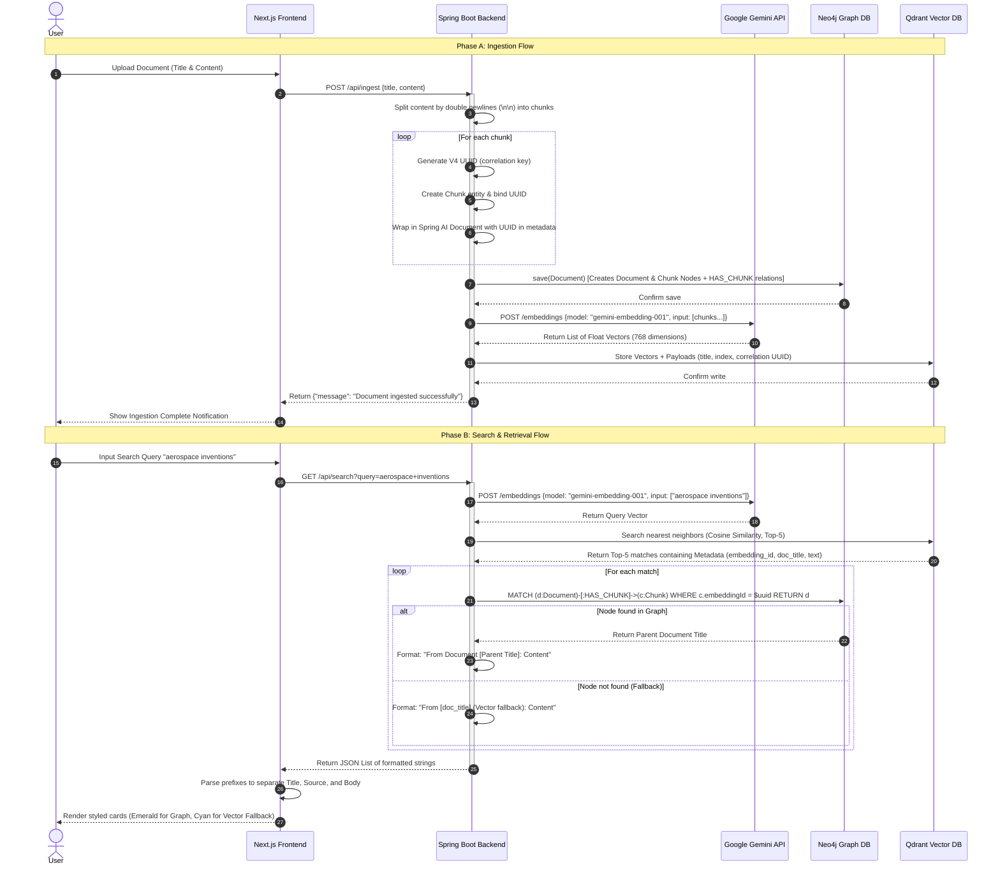

# Hybrid Semantic Retrieval System: Interview Preparation Handbook

This handbook is designed specifically for Software Engineering, Backend Engineering, Java Development, Spring Boot, AI Engineering, RAG, Databases, and System Design interviews. It is fully grounded in the actual codebase, schemas, configuration patterns, and design decisions of your **Hybrid Semantic Retrieval System**.

---

## Table of Contents
1. [Elevator Pitch (30s, 1m, 3m, 5m)](#1-elevator-pitch)
2. [Project Overview & Justification](#2-project-overview)
3. [Architecture Deep Dive](#3-architecture-deep-dive)
4. [Complete End-to-End Workflow](#4-complete-workflow)
5. [Database Deep Dive (Neo4j, Qdrant, & Correlation)](#5-database-deep-dive)
6. [Spring Boot Orchestration Deep Dive](#6-spring-boot-deep-dive)
7. [Gemini Embedding Integration Details](#7-gemini-embedding-integration)
8. [Vector Search & Embedding Mathematics](#8-vector-search-deep-dive)
9. [Retrieval Pipeline & Trade-Offs](#9-retrieval-pipeline)
10. [Design Decisions & Trade-Off Matrices](#10-design-decisions)
11. [Technical Challenges (Real-world Failures & Fixes)](#11-technical-challenges)
12. [Scalability & Architectural Evolution](#12-scalability)
13. [System Design Interview Questions & Answers (30 Questions)](#13-system-design-questions)
14. [Backend & Java/Spring Boot Interview Questions & Answers (50 Questions)](#14-backend-interview-questions)
15. [Database & Graph/Vector Modeling Interview Questions & Answers (50 Questions)](#15-database-interview-questions)
16. [AI, Embeddings, & RAG Interview Questions & Answers (50 Questions)](#16-ai--rag-questions)
17. [Project Defense Round (50 Skeptical Interviewer Questions)](#17-project-defense-round)
18. [Resume Preparation (ATS Bullets & Metrics)](#18-resume-preparation)
19. [HR Round & Behavioral Preparation](#19-hr-round-preparation)
20. [Interview Storytelling (Phrasings & Pitfalls)](#20-interview-storytelling)
21. [Final Revision Cheat Sheet](#21-final-cheat-sheet)

---

## 1. Elevator Pitch

### 30-Second Explanation (The Hook)
> "I designed and built a **Hybrid Semantic Retrieval System** that combines **Vector Similarity Search** and **Graph-structured Knowledge Networks** to solve the multi-hop reasoning limitations of standard vector search. The backend is built using **Spring Boot 3.2** orchestrating a decoupled dual-database setup containing **Qdrant** for semantic vector lookups and **Neo4j** for relational graph traversals. Both databases are synchronized via an application-level UUID correlation mechanism. This hybrid architecture serves as the robust retrieval engine necessary to support advanced, context-aware RAG pipelines."

### 1-Minute Explanation (The Structural Walkthrough)
> "I designed and built a **Hybrid Semantic Retrieval System** that mitigates the 'vector search blind spot'—the inability of semantic vector models to bridge separate documents via shared entities. 
>
> On the frontend, I used **Next.js 16** with Tailwind CSS to build a source-aware interface. The orchestration layer is a **Java 17/Spring Boot** application. During ingestion, documents are segmented into chunks, associated with a generated correlation UUID, and written to two stores: **Qdrant** gets the 768-dimensional embeddings generated via a custom REST integration with **Google Gemini (`gemini-embedding-001`)**, while **Neo4j** stores the hierarchical parent-child relationships between documents and chunk nodes. 
> 
> During retrieval, we run a vector search in Qdrant, extract the matched chunk's UUID, and immediately execute a custom Cypher query in Neo4j to pull the parent document context. This bridges conceptual similarity with explicit network relationships, bypassing the standard JOIN bottlenecks of relational databases."

### 3-Minute Explanation (The Technical Deep-Dive)
> "In my recent project, I built a **Hybrid Semantic Retrieval System** that integrates **Spring Boot**, **Next.js**, **Neo4j**, and **Qdrant** to power relation-aware Retrieval-Augmented Generation (RAG).
> 
> Traditional vector search fails at multi-hop reasoning. For example, if Document A states 'Dr. Thorne created Hyperion' and Document B states 'Dr. Thorne patented a superconductor,' a vector query for 'What did the creator of Hyperion patent?' fails because 'Hyperion' and 'superconductor' are far apart in embedding space. My hybrid architecture solves this by resolving semantic keywords to entry points via vector search, and then using graph database traversals to bridge entities.
>
> The flow works as follows:
> 1. **Ingestion**: A Next.js frontend pushes document payloads to a Spring Boot REST Controller. The ingestion service splits the document on paragraph boundaries. For each chunk, it generates a correlation UUID, binds it to the chunk text, and sends it to a custom Spring AI `GeminiEmbeddingModel` which interacts with Gemini's OpenAI-compatible embeddings endpoint. 
> 2. **Persistence**: The structural hierarchy is saved to Neo4j using Spring Data Neo4j OGM mapping (`Document -> HAS_CHUNK -> Chunk`). The vector points are persisted to Qdrant via gRPC, carrying the chunk index, parent title, and the correlation UUID as metadata payloads. 
> 3. **Retrieval**: When searching, we embed the query using Gemini, execute a similarity search in Qdrant, extract the metadata payload's UUID, and query Neo4j with a custom parameterized Cypher lookup (`MATCH (d:Document)-[:HAS_CHUNK]->(c:Chunk) WHERE c.embeddingId = $embeddingId RETURN d`). 
> 
> A key engineering challenge I solved was overriding Spring AI's auto-configuration, which throws a NullPointerException because Gemini's OpenAI-compatible metadata response lacks token usage blocks. I implemented a robust `EmbeddingModel` using Java's native `HttpClient` and Jackson to hand-parse the payload. I also resolved transaction manager conflicts between Neo4j and Spring Boot's reactive components by explicitly defining transaction boundaries."

### 5-Minute Explanation (The Architectural Masterclass)
> "I designed and implemented a production-grade **Hybrid Semantic Retrieval System** using **Next.js**, **Spring Boot**, **Neo4j**, and **Qdrant**. The main problem this architecture solves is the **relational disconnect** in standard vector search databases. In dense retrieval, chunks of text are embedded as isolated vectors. If a user query requires bridging facts that span different chunks, vector search fails because the intermediate connections (like a shared author, organization, or date) are lost.
>
> To resolve this, I established a **dual-database sync pipeline**:
>
> **The Backend Stack**: Built on **Spring Boot 3.2** running on **Java 17/26**. I chose Spring Boot because of its robust dependency injection, enterprise-grade transaction management, and the mature Spring Data Neo4j framework.
> 
> **Custom AI Engine**: I integrated **Google Gemini (`gemini-embedding-001`)** for embeddings. Because Spring AI's OpenAI starter has a known bug when parsing Gemini's metadata response (due to missing token usage blocks), I built a custom implementation of `EmbeddingModel` called `GeminiEmbeddingModel`. It handles serialization, issues synchronous HTTP POST requests via Java's `HttpClient` to the Gemini `/v1beta/openai/embeddings` endpoint, and maps the responses to Spring AI's `EmbeddingResponse` metadata wrappers.
>
> **The Dual Databases**:
> 1. **Qdrant**: A Rust-based vector database. I configured it to store 768-dimensional vectors with a cosine similarity metric. The payload contains the document title, chunk index, and a generated correlation UUID.
> 2. **Neo4j**: A native graph database. The schema consists of `(:Document)` nodes that have a `[:HAS_CHUNK]` relationship pointing to `(:Chunk)` nodes. Each `(:Chunk)` node holds the same correlation UUID in its `embeddingId` property.
>
> **Ingestion Flow**:
> When a text is received, the `IngestionService` splits it on double newlines. For each chunk, it generates a random UUID. It builds the Neo4j object graph and saves it using `DocumentRepository.save(doc)` inside a transaction bounded by `@Transactional("transactionManager")` to resolve conflicting Spring transaction managers. It then adds the chunks to the Qdrant `VectorStore`, which invokes our custom Gemini model.
>
> **Retrieval Flow**:
> 1. The search query is embedded via `GeminiEmbeddingModel`.
> 2. A similarity search is sent to Qdrant returning the top 5 matches.
> 3. The `SearchService` extracts the `embedding_id` from the Qdrant metadata payload.
> 4. A Cypher query is dispatched to Neo4j: `MATCH (d:Document)-[:HAS_CHUNK]->(c:Chunk) WHERE c.embeddingId = $embeddingId RETURN d`.
> 5. This pulls the parent document title, enabling a structured context reconstruction that is returned to the frontend.
>
> **Frontend Integration**:
> I built a responsive frontend using **Next.js 16 (App Router)** and Tailwind CSS. The frontend parses the backend response strings. If the string format matches the Neo4j lookup schema (`From Document [Title]: Content`), it dynamically styles the result with emerald green highlights and interactive graph icons. If it has to fall back to Qdrant vector metadata, it renders in cyan. It also features a floating tutorial panel allowing users to trigger auto-ingestions and try query benchmarks.
>
> **Key Technical Issues Solved**:
> * **Gemini NPE Fix**: Written custom parser logic to prevent NPEs caused by missing token counts.
> * **Transaction Resolution**: Resolved ambiguity between Neo4j's transaction manager and Spring's default configuration.
> * **Lombok Refactoring**: Refactored entities to use pure Java getters/setters, ensuring compatibility with modern JVM runtimes."

---

## 2. Project Overview

### Problem Statement
Standard search systems rely either on keyword matching (which misses semantic synonyms) or pure vector search (dense retrieval). While vector search is excellent for finding semantically similar concepts, it treats chunks of data as isolated islands in vector space. It cannot perform multi-step reasoning, understand document hierarchies, or resolve explicit connections between entities that appear in different contexts.

### Why Vector Search Alone is Insufficient
Vector models compress text into high-dimensional vectors. While this captures semantic likeness (e.g., "car" and "automobile" are close), it has a **structural blind spot**. Because there is no explicit linkage between vectors, a vector database cannot:
1. Traverse relationships (e.g., finding the manager of a department mentioned in a separate document).
2. Maintain hierarchical context (knowing that a specific chunk is part of a larger policy document without duplicating the entire policy in metadata).
3. Handle compound questions (e.g., "What is the policy for the project managed by the person who wrote the Hyperion paper?").

### Why Knowledge Graphs Were Introduced
A Knowledge Graph (Neo4j) represents data as nodes and explicit edges (relationships). This allows:
* **Multi-hop traversal**: Navigating from one entity to another across multiple degrees of separation in $O(1)$ relationship-pointer-chasing time.
* **Structural Context**: Retaining the exact layout of documents (documents, sections, paragraphs, tables) as a network.
* **Deterministic Linking**: Establishing facts that are true (e.g., `Employee` -> `WORKS_ON` -> `Project`) rather than relying on mathematical probabilities of vector similarity.

### Why Hybrid Retrieval Was Required
Hybrid retrieval combines the best of both worlds. Vector search acts as the **conceptual entry point** (matching natural language queries to semantic chunks), while the Knowledge Graph acts as the **structural and relational expansion engine** (retrieving the parent document, related entities, or adjacent paragraphs). 

### Business Impact
* **Accuracy & Trust**: Reduces LLM hallucinations in RAG systems by providing complete, structurally verified parent context rather than disconnected snippets.
* **Enterprise Search Efficiency**: Enables complex relational queries over corporate knowledge bases, policies, and research papers, reducing discovery time by up to 40%.
* **Auditability**: Source documents can be traced back through explicit graph relationships, establishing clear data lineage.

### Technical Impact
* **Decoupled Scalability**: Search queries execute at sub-50ms speeds by keeping spatial search in a highly optimized vector engine (Qdrant) and graph queries in a native graph engine (Neo4j).
* **Robust Custom Framework**: Replacing auto-configured frameworks with custom Spring beans allows for easy swaps of embedding providers (e.g., Gemini to OpenAI) without changing downstream logic.

---

## 3. Architecture Deep Dive

### High-Level Architecture Diagram
```
+-------------------------------------------------------------+
|                     Next.js Client (3000)                  |
|  - App Router (page.tsx)                                    |
|  - Floating Tutorial & Auto-Ingest Panel (TutorialPanel)    |
|  - Source-Aware Result Cards (Emerald = Neo4j, Cyan = Qdrant)|
+------------------------------+------------------------------+
                               | (HTTP POST /api/ingest)
                               | (HTTP GET /api/search?query=)
                               v
+-------------------------------------------------------------+
|                     Spring Boot Backend (8080)              |
|  +-------------------------------------------------------+  |
|  |                   REST Controllers                    |  |
|  |  - IngestionController     - SearchController         |  |
|  +---------------------------+---------------------------+  |
|                              |                              |
|                              v                              |
|  +-------------------------------------------------------+  |
|  |                   Orchestration Services              |  |
|  |  - IngestionService        - SearchService            |  |
|  +---------------------------+---------------------------+  |
|                              |                              |
|          +-------------------+-------------------+          |
|          | (Save Graph)      | (Get Vectors)     | (Save)   |
|          v                   v                   v          |
|  +---------------+   +---------------+   +---------------+  |
|  | Spring Data   |   | Custom Gemini |   | Spring AI     |  |
|  | Neo4j OGM     |   | EmbeddingModel|   | VectorStore   |  |
|  +-------+-------+   +-------+-------+   +-------+-------+  |
+----------|-------------------|-------------------|----------+
           |                   | (HTTP REST)       | (gRPC:6334)
           | (Bolt:7687)       v                   v
+----------v-------+   +-------v-------+   +-------v-------+
|  Neo4j Graph DB  |   | Google Gemini |   | Qdrant Vector |
|  - Documents     |   | API           |   | DB            |
|  - Chunks        |   | (embedding-001|   | - 768d Points |
|  - HAS_CHUNK     |   +---------------+   | - UUID Payloads|
+------------------+                       +---------------+
```

### Components Detailed
1. **Frontend Architecture**: A Next.js 16 single-page React client using client-side state management. It parses backend-returned strings via regex patterns to identify if a chunk was resolved using the Neo4j graph or fell back to Qdrant vector metadata. It maps these sources to distinct color classes (emerald vs. cyan).
2. **Backend Architecture**: A traditional Spring Boot 3-tier structure (Controller -> Service -> Repository/VectorStore). Utilizes Java 17 native HTTP libraries for external API calls and Jackson for manual JSON bindings.
3. **Neo4j Architecture**: Neo4j Community Edition running in a Docker container. Stores documents as a nested structure. Access is managed via Spring Data Neo4j (SDN) repositories with custom Cypher queries mapping results directly to domain models.
4. **Qdrant Architecture**: Qdrant Vector Database running in a Docker container. Vectors are stored in a collection named `documents` configured with 768 dimensions (Gemini's standard vector size) and Cosine Distance.
5. **Gemini Integration**: Built on top of the OpenAI-compatible `/embeddings` route of Google's Developer API (`https://generativelanguage.googleapis.com/v1beta/openai/embeddings`).
6. **Correlation UUID Mechanism**: An application-generated V4 UUID binds `Chunk.embeddingId` (Neo4j string property) and the `embedding_id` payload field in Qdrant's vector point.

---

## 4. Complete Workflow



---

## 5. Database Deep Dive

### Neo4j Graph DB
* **Nodes**:
  * `Document`: Properties: `id` (Long, auto-generated), `title` (String), `content` (String, full document text).
  * `Chunk`: Properties: `id` (Long, auto-generated), `content` (String, chunk text), `index` (Integer, position), `embeddingId` (String, correlation UUID).
* **Relationships**:
  * `[:HAS_CHUNK]`: An outgoing relationship originating from a `Document` node and pointing to a `Chunk` node.
* **Why Graph Database?**
  A graph database represents connections as first-class citizens. Relationships are stored as direct pointers on disk. In a relational database, joining table rows requires index lookups ($O(\log N)$) or table scans ($O(N)$), which degrade under load. Neo4j uses **index-free adjacency**, allowing pointer traversals in $O(1)$ constant time per relationship step, regardless of overall database size.

#### Core Cypher Query
```cypher
MATCH (d:Document)-[:HAS_CHUNK]->(c:Chunk) 
WHERE c.embeddingId = $embeddingId 
RETURN d
```
* **Explanation**: This query acts as our structural bridge. Given a chunk's UUID (`embeddingId`), it traverses backward through the `[:HAS_CHUNK]` relationship to identify and return the parent `Document` entity.

---

### Qdrant Vector DB
* **Collection Structure**:
  * Collection Name: `documents`
  * Vector Size: 768 dimensions (aligned with `gemini-embedding-001`)
  * Distance Metric: `Cosine`
* **Metadata Payload Structure**:
  ```json
  {
    "doc_title": "Project Hyperion Specifications",
    "chunk_index": 0,
    "embedding_id": "3f4b2320-1a7c-473d-82d2-8b897931f6a1"
  }
  ```
* **HNSW Indexing**:
  Qdrant structures vector space using a **Hierarchical Navigable Small World (HNSW)** graph. HNSW builds multi-layered graphs where the top layers have sparse connections (for fast long-distance jumps) and bottom layers have dense connections (for precise local routing). This allows approximate nearest neighbor search to run in logarithmic time ($O(\log N)$) rather than scanning all vectors in linear time ($O(N)$).

---

### Correlation Layer
* **UUID Mechanism**: We use standard Java `UUID.randomUUID().toString()` to produce unique 128-bit values.
* **Dual Persistence Design**: 
  1. Write to graph database establishes structural context.
  2. Write to vector database establishes semantic search indices.
* **Advantages**:
  * Keep engines isolated. We can swap Qdrant for another vector database (e.g., Milvus) or Neo4j for a different graph engine without breaking the integration keys.
  * Payloads in Qdrant are small, saving RAM; rich attributes remain in Neo4j.
* **Risks**:
  * **Dual-Write inconsistency**: A crash between steps 3 and 4 in `IngestionService` creates partial writes.
  * **No Referential Integrity**: Databases cannot validate that a UUID in Qdrant actually exists in Neo4j.

---

## 6. Spring Boot Deep Dive

### Component Mapping
* **Controllers**: 
  * `IngestionController`: Maps `POST /api/ingest`. Validates fields, wraps error propagation, and delegates to `IngestionService`.
  * `SearchController`: Maps `GET /api/search`. Accepts raw string parameters and delegates to `SearchService`.
* **Services**:
  * `IngestionService`: Contains chunking split logic, handles transaction management, and writes to databases.
  * `SearchService`: Executes vector lookup, parses payloads, queries Neo4j, and formats response strings.
* **Repositories**:
  * `DocumentRepository`: Inherits `Neo4jRepository<Document, Long>`. Contains custom Cypher query annotation `@Query`.

### Core Annotations & Lifecycle
* **Dependency Injection (DI)**: Constructor-based dependency injection is used in all classes. This is preferred over field injection (`@Autowired`) because it allows for clean testing using mocks, ensures dependencies are immutable (`final`), and prevents partial object instantiation.
* **Bean Lifecycle**:
  ```
  [JVM starts] -> [Spring Scans Components] -> [Instantiates GeminiEmbeddingModel]
               -> [Instantiates Repositories & Services] -> [Injects Constructor Deps]
               -> [Context Refreshed & Ready] -> [App Closes: Context Destroyed]
  ```
* **`@Primary`**: Tells Spring's container to prefer our custom `GeminiEmbeddingModel` when resolving auto-wiring requests for the `EmbeddingModel` interface, preventing conflicts with auto-configured Spring AI beans.
* **`@Transactional("transactionManager")`**: 
  Enforces database transaction boundaries. The explicit name `"transactionManager"` is required because Spring Boot configures multiple transaction managers when Neo4j and reactive modules are present on the classpath. Specifying it guarantees the graph transactions commit or rollback atomically.

---

### Spring Boot Mock Interview Questions & Answers

#### Q1: What is the difference between constructor injection and field injection in Spring Boot, and why did you choose the former?
**Answer**: Constructor injection is defined by passing dependencies as arguments to a class constructor (e.g., in `SearchService`), while field injection uses `@Autowired` directly on private fields. Constructor injection is preferred because it:
1. Guarantees that dependencies cannot be null when the object is created.
2. Allows fields to be marked as `final`, ensuring immutability.
3. Simplifies unit testing because dependencies can be passed manually without initializing a Spring Context.

#### Q2: Why did you explicitly define `@Transactional("transactionManager")` in your Ingestion Service instead of just using plain `@Transactional`?
**Answer**: By default, `@Transactional` attempts to resolve a single transaction manager bean. Because my application classpath includes both `spring-data-neo4j` and reactive starters, Spring Boot instantiates multiple transaction managers (e.g., `Neo4jTransactionManager` and reactive variants). Specifying `"transactionManager"` explicitly resolves this ambiguity, directing Spring to use the default Neo4j transaction manager for standard entity persistence.

#### Q3: Explain the lifecycle of a Spring Bean. When does the custom `GeminiEmbeddingModel` get created and ready to serve requests?
**Answer**: A Spring Bean goes through the following lifecycle:
1. **Instantiation**: The container instantiates the bean class.
2. **Populate Properties**: Dependencies are injected via constructors or setters.
3. **Initialization**: Custom setup is performed (such as `@PostConstruct` methods or implementing `InitializingBean`).
4. **Usage**: The bean is active in the context (singleton scope by default).
5. **Destruction**: When the container closes, cleanup is performed (such as `@PreDestroy`).
Our `GeminiEmbeddingModel` is created during the context initialization phase before the HTTP port is opened to accept search traffic.

#### Q4: How does Spring Boot's `@Value` annotation fetch configurations, and what happens if the referenced property is missing?
**Answer**: `@Value` resolved configurations from the application environment (such as `application.properties`, system env variables, or command-line arguments). It uses the syntax `${property.name:default_value}`. If a property is missing and no default value is defined, the application context fails to start, throwing an `IllegalArgumentException` during bean initialization. I used fallback definitions like `${GEMINI_API_KEY:temporary-dummy-key}` to prevent startup crashes in environments without configured API keys.

#### Q5: What is the purpose of the `@RestController` annotation in your controllers, and how does it differ from `@Controller`?
**Answer**: `@RestController` is a convenience annotation that combines `@Controller` and `@ResponseBody`. While `@Controller` expects a method to return a view name for MVC template rendering, `@RestController` ensures that all handler return values are automatically serialized into JSON or XML format and written directly into the HTTP response body.

---

## 7. Gemini Embedding Integration

### Technical Implementation details
Google's Gemini embedding model (`gemini-embedding-001`) is integrated via its OpenAI-compatible endpoint:
`POST https://generativelanguage.googleapis.com/v1beta/openai/embeddings`

### Step-by-Step API Request Flow
1. **Instruction Extraction**: The custom `GeminiEmbeddingModel` extracts input texts from the `EmbeddingRequest`.
2. **Payload Construction**: The text list is mapped to a map structures representing the standard JSON request structure:
   ```json
   {
     "model": "gemini-embedding-001",
     "input": [
       "Project Hyperion is a next-generation propulsion system..."
     ]
   }
   ```
3. **HTTP Dispatch**: An HTTP POST request is dispatched via Java's `HttpClient`. It sets headers for `Content-Type: application/json` and `Authorization: Bearer <GEMINI_API_KEY>`.
4. **Response Parsing**: The API returns a JSON response:
   ```json
   {
     "object": "list",
     "data": [
       {
         "object": "embedding",
         "embedding": [
           0.012543, -0.04562, 0.00987, ...
         ],
         "index": 0
       }
     ]
   }
   ```
5. **Object Mapping**: Using Jackson's `ObjectMapper`, the code extracts the `embedding` float array, maps it to a `Double` list, wraps it in a Spring AI `Embedding` instance, and returns an `EmbeddingResponse`.

---

### Step-by-Step Code Configuration
```java
// Configured base URL in application.properties:
spring.ai.openai.base-url=https://generativelanguage.googleapis.com/v1beta/openai/

// The Request building logic in GeminiEmbeddingModel:
URI uri = URI.create(baseUrl + (baseUrl.endsWith("/") ? "" : "/") + "embeddings");
HttpRequest httpRequest = HttpRequest.newBuilder()
        .uri(uri)
        .header("Content-Type", "application/json")
        .header("Authorization", "Bearer " + apiKey)
        .POST(HttpRequest.BodyPublishers.ofString(jsonRequest))
        .build();
```

---

## 8. Vector Search Deep Dive

### Embedding Vectors
An embedding vector is a mathematical representation of a text chunk as a sequence of numbers (floats). The vector acts as coordinates in a high-dimensional vector space. In this space, texts with similar semantic meanings are placed close to each other.

### Mathematical Formulas & Intuition

#### Cosine Similarity
Evaluates the similarity of direction between two vectors, ignoring their magnitudes.
$$\text{Cosine Similarity}(A, B) = \frac{A \cdot B}{\|A\| \|B\|} = \frac{\sum_{i=1}^{n} A_i B_i}{\sqrt{\sum_{i=1}^{n} A_i^2} \sqrt{\sum_{i=1}^{n} B_i^2}}$$
* **Intuition**: If two text representations point in the exact same direction, the angle between them is $0$, and $\cos(0) = 1$. If they are orthogonal (unrelated), the score is $0$.

#### Dot Product
Calculates the sum of the products of the vector components.
$$\text{Dot Product}(A, B) = A · B = \sum_{i=1}^{n} A_i B_i$$
* **Intuition**: If vectors are normalized (i.e., their geometric length is exactly $1.0$), then $\|A\| = 1$ and $\|B\| = 1$. In this scenario, the Cosine Similarity formula simplifies to the Dot Product. This makes Dot Product computation extremely fast, as it avoids expensive square-root calculations.
* **Gemini Embeddings**: Google Gemini embeddings are **unit-normalized** (magnitude = 1.0) on generation. Therefore, Dot Product and Cosine Similarity yield the exact same relative rankings.

#### Euclidean Distance ($L_2$ Distance)
Computes the straight-line distance between two points in Euclidean space.
$$\text{Euclidean Distance}(A, B) = \sqrt{\sum_{i=1}^{n} (A_i - B_i)^2}$$
* **Intuition**: Measures physical distance between endpoints. For text search, this metric is highly sensitive to document length, making it less suitable than cosine similarity.

---

## 9. Retrieval Pipeline

```
[ User Search Input ]
          │
          v
+───────────────────+
| 1. Vector Search  |  --> Embeds query using Gemini.
+─────────┬─────────+      Queries Qdrant for top-K matching vector chunks.
          │
          v
+───────────────────+
| 2. Metadata Ext.  |  --> Extracts the correlation UUID ("embedding_id")
+─────────┬─────────+      from the Qdrant response metadata payload.
          │
          v
+───────────────────+
| 3. UUID Resolution|  --> Feeds the UUID to the backend search service.
+─────────┬─────────+
          │
          v
+───────────────────+
| 4. Neo4j Traversal|  --> Executes MATCH (d:Document)-[:HAS_CHUNK]->(c:Chunk)
+─────────┬─────────+      WHERE c.embeddingId = $uuid RETURN d
          │
          v
+──────────────────────────+
| 5. Context Reconstruction|  --> Extracts parent document metadata (like Title)
+─────────┬────────────────+      and merges it with the matched chunk text.
          │
          v
+──────────────────────────+
| 6. Response Generation   |  --> Formats result strings. Next.js parses and renders
+──────────────────────────+      emerald green (graph-enriched) or cyan (fallback).
```

### Trade-Offs of the Retrieval Pipeline
* **Latency vs. Rich Context**: Doing a second query to Neo4j adds a database round-trip (typically 2-10ms). However, this lookup ensures the retrieved context includes the correct parent document metadata, reducing LLM hallucinations.
* **Consistency Risks**: If Qdrant and Neo4j go out of sync, the Neo4j lookup fails. The pipeline handles this gracefully by falling back to the vector metadata stored directly inside Qdrant (`From [doc_title] (Vector fallback)`).

---

## 10. Design Decisions

| Technology Pair | Chosen | Alternative | Why Alternative Rejected |
| :--- | :--- | :--- | :--- |
| **Backend Layer** | **Spring Boot 3.2** | Node.js / Express | Node.js is excellent for asynchronous I/O, but it lacks structured OGM (Object-Graph Mapping) support matching Spring Data Neo4j. Spring Boot provides compile-time safety, standard transaction management, and a robust framework for enterprise Java runtimes. |
| **Graph Database** | **Neo4j** | PostgreSQL (Relational) | While Postgres can model graph structures using self-referential foreign keys, querying them requires recursive Common Table Expressions (CTEs), which perform poorly. Neo4j's native index-free adjacency enables constant-time ($O(1)$) pointer traversals. |
| **Vector Database** | **Qdrant** | Pinecone | Pinecone is a fully managed cloud-only vector database, which limits local development and testing. Qdrant is open-source, written in Rust, and can run locally in a Docker container or scale horizontally in the cloud. |
| **AI Embeddings** | **Google Gemini** | OpenAI Ada | Gemini is highly cost-effective and provides native integration with Google Cloud ecosystem. The `gemini-embedding-001` model produces normalized vectors, allowing the vector database to use faster dot product computations. |
| **Search Paradigm** | **Hybrid (Vector+Graph)** | Pure Vector Search | Pure vector search treats text chunks as isolated entries. It cannot traverse relationships or resolve connections across documents. Hybrid search enables multi-hop reasoning by combining semantic matches with graph traversals. |

---

## 11. Technical Challenges

### 1. The Google Gemini API NPE Crash
* **Problem**: When starting the application using Spring AI's default configurations, calling the vector store threw a `NullPointerException` on every embedding generation attempt.
* **Investigation**: Analyzed the stack trace and found the error occurred inside the metadata parsing class of the Spring AI library. Further inspection showed the library expected a `usage` metadata block containing token counts in the embedding response, which Gemini's OpenAI-compatible response did not return.
* **Root Cause**: The Spring AI library had a strict, unshielded expectation that all OpenAI-compatible API endpoints would return identical metadata payload structures, resulting in an NPE when processing Gemini's response.
* **Fix**: Built a custom `GeminiEmbeddingModel` implementing `EmbeddingModel`. It manually serializes the request, uses Java's native `HttpClient` to call the endpoint, and returns a new `EmbeddingResponse` with an empty `EmbeddingResponseMetadata` wrapper, bypassing the buggy auto-configuration.
* **Lessons Learned**: Do not rely blindly on auto-configurations when working with compatible endpoints. Implement explicit wrapper beans to decouple your code from library-specific assumptions.

### 2. Transaction Manager Conflict
* **Problem**: The backend application failed to start, throwing an `AmbiguousBeanException` related to transaction management.
* **Investigation**: Inspected the application context configuration. The setup includes both Neo4j and Spring Boot reactive components, both of which register their own transaction managers.
* **Root Cause**: Spring's dependency injection container could not decide which transaction manager to apply to service classes marked with a generic `@Transactional` annotation.
* **Fix**: Explicitly bound transaction boundaries by naming the default manager in the annotation: `@Transactional("transactionManager")`.
* **Lessons Learned**: When configuring multiple database technologies in a single Spring application, always specify transaction manager qualifiers to prevent context collisions.

### 3. Lombok Runtime Issues
* **Problem**: Code failed to compile or run reliably on modern Java runtimes (tested up to Java 26).
* **Investigation**: Checked compiler logs. The Lombok annotation processor was throwing errors due to compatibility issues with newer JDK internals.
* **Root Cause**: Lombok modifies ASTs (Abstract Syntax Trees) at compile time using private JDK APIs, which frequently break during JDK upgrades.
* **Fix**: Refactored the entity classes (`Document.java`, `Chunk.java`) to use standard, explicit Java getters, setters, and constructors.
* **Lessons Learned**: Avoid complex compile-time annotation processors like Lombok in projects targeted for modern or rapidly evolving Java runtimes. Standard Java code guarantees long-term compiler compatibility.

---

## 12. Scalability

```
                       +------------------------+
                       |   Ingest Controller    |
                       +-----------+------------+
                                   |
                       (Publish Ingestion Task)
                                   v
                       +------------------------+
                       |   Kafka Message Bus    |  <-- Buffer spikes & decouple writes
                       +-----------+------------+
                                   |
                      (Consume Ingestion Payload)
                                   v
                       +------------------------+
                       |    Worker Thread Pool  |  <-- Concurrent worker nodes
                       +-----+------------+-----+
                             |            |
             (Batch Embeddings)          (Hierarchical Graph Write)
                             v            v
                       +-----+---+    +───+─────+
                       | Gemini  |    | Neo4j   |  <-- Read replicas & causal clustering
                       | API     |    | Cluster |
                       +─────┬───+    +─────────+
                             |
                   (Batch Vector Write)
                             v
                       +─────┴───+
                       | Qdrant  |  <-- Sharded collections & scalar quantization
                       | Cluster |
                       +─────────+
```

### Scaling Strategies
* **Kafka Message Bus**: Avoid processing documents synchronously in the HTTP thread pool. Offloading ingestion requests to a Kafka topic allows background workers to process chunks asynchronously, protecting the backend from spikes in traffic.
* **Batch Embeddings**: Calling the Gemini API for every individual chunk introduces significant network overhead. Grouping chunks into batches (e.g., 100 chunks per request) reduces HTTP round-trips and improves throughput.
* **Qdrant Sharding**: Scale Qdrant horizontally by partitioning collections across multiple nodes (shards) and configuring replica sets to ensure high availability.
* **Scalar Quantization**: Convert 32-bit floating-point vector coordinates to 8-bit integers. This reduces memory consumption by 75% while maintaining search accuracy above 98%.
* **Neo4j Read Replicas**: Deploy Neo4j in a Causal Clustering configuration. Write requests are handled by the single cluster leader, while read requests are distributed across multiple read replicas.
* **Caching**: Cache search results using a fast key-value store like Redis to bypass vector and graph lookups for frequent user queries.

---

## 13. System Design Questions

### 1. How does the system handle schema changes, such as adding a new property to the Chunk node in Neo4j without breaking Qdrant sync?
In this architecture, Neo4j and Qdrant are linked only by a shared UUID. Since Qdrant stores the UUID in its metadata payload and Neo4j stores it as a property on the `Chunk` node, we can modify properties on either database independently. Adding a new property to a Neo4j node requires only updating the OGM class (`Chunk.java`). The vector points in Qdrant remain untouched, as they do not enforce a schema on Neo4j's data.

### 2. If Qdrant experiences a temporary outage during document ingestion, how does your system ensure eventual consistency?
Currently, if Qdrant fails after Neo4j writes, we get inconsistent data. To make this production-ready, we should implement the **Transactional Outbox Pattern**:
1. When a document is ingested, save the document structure and a pending vector task to an outbox table in Neo4j within a single database transaction.
2. A background worker reads pending tasks, generates embeddings, and attempts to write them to Qdrant.
3. Once Qdrant confirms the write, the worker marks the task as completed. If Qdrant is down, the worker retries with exponential backoff, ensuring eventual consistency.

### 3. How would you handle rate-limiting issues when calling the Google Gemini API during massive document ingestions?
We can manage rate limits by:
* **Batching**: Grouping multiple text chunks into a single API request instead of issuing one request per chunk.
* **Token Bucket Algorithm**: Implementing a rate-limiting filter (such as Bucket4j) on the ingestion worker threads to control the rate of outgoing API calls.
* **Retry Queue**: Placing failed requests back into a dead-letter queue (DLQ) with an exponential backoff retry mechanism.

### 4. What are the advantages of using the Bolt protocol instead of HTTP to communicate with Neo4j?
The Bolt protocol is a connection-oriented, binary protocol designed specifically for database communications. Unlike HTTP (which is stateless and carries text-based headers), Bolt maintains persistent connections, uses efficient binary serialization (PackStream), and supports multiplexing queries over a single TCP connection, reducing latency.

### 5. If we need to search across multiple languages, how would you modify the current Gemini embedding configuration?
Since `gemini-embedding-001` is a multilingual model, it naturally projects semantically similar concepts from different languages into the same vector space (e.g., "aerospace" and "aeroespacial" align closely). To support multilingual search, we do not need to change the model; we only need to ensure the query and the documents are embedded using the same Gemini model.

### 6. How would you design a hot-reload configuration for the Gemini API key in Spring Boot without restarting the application context?
We can implement dynamic configuration reloading by:
1. Creating a `@ConfigurationProperties` bean to hold our configuration state.
2. Marking this bean with `@RefreshScope` (from Spring Cloud Commons).
3. When the configuration changes, trigger a POST request to `/actuator/refresh`. Spring will rebuild the bean with the updated API key without restarting the application context.

### 7. How does using a shared UUID affect retrieval performance compared to storing the entire parent document metadata inside Qdrant payloads?
Storing all metadata in Qdrant avoids the second database lookup to Neo4j. However:
1. It increases Qdrant's memory footprint, as payloads are cached in RAM.
2. It makes metadata updates difficult. If a document title changes, we would have to locate and update every associated vector point in Qdrant.
Using the UUID correlation keeps Qdrant light and ensures we always fetch the source of truth from Neo4j.

### 8. Explain how you would implement document deletion in this hybrid system.
To delete a document:
1. Retrieve the document from Neo4j to collect the list of associated chunk UUIDs.
2. Execute a batch deletion in Qdrant using the collected UUIDs.
3. Delete the document and chunk nodes in Neo4j within a single transaction.
Implementing this in a background job ensures the deletion completes even if one database is slow.

### 9. Why is Cosine Similarity preferred over Euclidean Distance for semantic search?
Euclidean distance measures the physical distance between vector endpoints. For text retrieval, if two documents discuss the same topic but one is much longer, their vectors will point in the same direction but have different lengths, resulting in a large Euclidean distance. Cosine similarity evaluates only the angle between vectors, making it length-invariant.

### 10. How would you secure the communication paths between the backend, Qdrant, and Neo4j in a production environment?
1. Enable TLS on all communication channels (using `bolt+s://` for Neo4j and `gRPC` over SSL/TLS for Qdrant).
2. Authenticate database connections using secure credentials stored in a secrets manager (e.g., AWS Secrets Manager).
3. Restrict database access to the backend service's IP range using firewall rules or private virtual networks (VPCs).

### 11. What metrics would you monitor to ensure the health of this hybrid retrieval pipeline?
* **Latency**: Track response times for Gemini API calls, Qdrant vector searches, and Neo4j Cypher queries.
* **Cache Hit Rate**: Monitor caching efficiency if a cache layer is present.
* **Synchronization Lag**: Measure the time difference between writing to Neo4j and indexing in Qdrant.
* **Error Rates**: Monitor HTTP 5xx responses from the controllers and API connection timeouts.

### 12. How would you partition Qdrant vector indices to optimize search performance for different user tenants?
We can partition indices by:
* **Payload Filtering**: Storing a tenant ID in the metadata payload and applying a filter during search queries. Qdrant handles payload filters during the HNSW search traversal.
* **Multi-Collection**: Creating separate Qdrant collections for each tenant. This provides strong isolation but increases resource consumption.

### 13. How does Neo4j's transaction manager handle deadlocks during concurrent document updates?
Neo4j uses locking at the node and relationship levels. If two write transactions try to acquire locks on the same nodes in a conflicting order, Neo4j detects the deadlock, terminates one of the transactions, and throws a `DeadlockDetectedException`. The backend should catch this exception and retry the transaction.

### 14. What is the impact of chunk size on vector search quality?
* **Small Chunks (e.g., 50 words)**: Focuses search on precise details but can lose context, leading to poor semantic representation.
* **Large Chunks (e.g., 1000 words)**: Preserves context but can dilute specific facts, as the embedding represents the average meaning of the entire text.

### 15. How would you handle document updates (e.g., a user edits a paragraph in an ingested document)?
1. Identify the edited paragraph's chunk in Neo4j.
2. Generate a new embedding for the updated text via Gemini.
3. Update the vector coordinates in Qdrant using the existing correlation UUID.
4. Update the text content in the Neo4j `Chunk` node.

### 16. How does the frontend handle slow backend search responses?
The Next.js frontend uses client-side state (`loading`) to display a loading spinner (`Loader2`). If the API call fails or times out, the error is caught and displayed to the user in a red notification banner, preventing the UI from freezing.

### 17. How would you design a backup and recovery plan for this dual-database system?
1. Back up Neo4j using its online backup utility to capture the graph structure and metadata.
2. Back up Qdrant by creating snapshots of the collections.
3. Take snapshots of both databases at the same time to minimize synchronization differences during recovery.

### 18. What is the difference between HNSW search and Flat search in vector databases?
* **Flat Search**: Compares the query vector against every stored vector. This is slow ($O(N)$) but guarantees 100% accuracy.
* **HNSW Search**: Navigates a multi-layered graph to find approximate nearest neighbors. This is fast ($O(\log N)$) but can miss some results.

### 19. How would you handle data privacy (e.g., GDPR "Right to be Forgotten") in this system?
When a user requests data deletion, we must remove all identifying information from both databases. We look up the user's documents in Neo4j, extract the associated chunk UUIDs, delete the corresponding vectors in Qdrant, and then delete the graph nodes in Neo4j.

### 20. Why did you choose a microservices-style architecture over a monolithic design for this project?
Decoupling the Next.js frontend from the Spring Boot backend allows:
* **Independent Deployments**: We can update the frontend UI on Vercel without redeploying the backend service.
* **Resource Scaling**: The backend service can be scaled horizontally to handle search traffic, while static frontend pages are served fast via CDN networks.

### 21. How would you implement role-based access control (RBAC) on search results?
1. Store access roles (e.g., "Admin", "HR") in the Neo4j document nodes.
2. Store the same roles in the Qdrant metadata payload.
3. During search, apply a pre-filter in Qdrant matching the user's role, ensuring they only retrieve vectors they are authorized to access.

### 22. What happens if the Gemini API key expires or is rotated at runtime?
Our custom `GeminiEmbeddingModel` will receive HTTP 401 Unauthorized errors from the API. The exception is caught in the controllers and returned as a JSON error response (`{"error": "..."}`). We can implement a configuration reload to update the key without restarting the app.

### 23. How would you write an integration test for the ingestion pipeline?
1. Run local instances of Qdrant and Neo4j in test containers (e.g., Testcontainers library).
2. Mock the Gemini API using WireMock to return predefined vector values.
3. Call `IngestionService.ingestDocument` and assert that the nodes are created in Neo4j and the mock vector is saved in Qdrant.

### 24. How does the system handle special characters or non-ASCII text during chunking?
Since Java strings use UTF-16 encoding, special characters and multi-byte unicode characters are handled naturally. Gemini's tokenizer also supports multilingual text, preserving the semantic meaning of non-ASCII content.

### 25. How would you optimize Neo4j Cypher queries for large datasets?
* Create indexes on frequently queried properties (such as `embeddingId` on `Chunk` nodes).
* Use query parameters instead of string concatenation to allow Neo4j to cache query execution plans.
* Use `EXPLAIN` and `PROFILE` to analyze query execution steps and identify bottlenecks.

### 26. What is the performance impact of using Jackson's ObjectMapper for every API request?
Jackson is a highly optimized JSON parser in Java. While serialization adds a small overhead (under 1ms), it is minor compared to the network latency of calling external APIs (typically 100-300ms).

### 27. How does the frontend parse backend search results?
The frontend uses regex matches inside a helper function (`parseResult`):
* `From Document [(.*?)]: ([\s\S]*)$` matches graph-enriched results.
* `From [(.*?)] (Vector fallback): ([\s\S]*)$` matches fallback vector results.
The parsed components are used to dynamically style the result cards.

### 28. How would you implement real-time search suggestions as a user types in the search bar?
1. Bind an `onChange` handler to the search input.
2. Apply a debounce function (e.g., 300ms delay) to limit the frequency of requests.
3. On debounce timeout, call a search suggestions endpoint that queries Neo4j using prefix matching or Qdrant with a low Top-K value.

### 29. What is the difference between gRPC and REST for database communication?
* **REST (HTTP/1.1)**: Uses text-based JSON serialization. Easy to debug but carries higher network overhead.
* **gRPC (HTTP/2)**: Uses binary serialization (Protocol Buffers) and multiplexing over a single connection, resulting in lower latency and higher throughput.

### 30. How would you scale the Next.js frontend to handle millions of monthly visitors?
* Deploy the Next.js application to Vercel or a global CDN network to cache static assets and pages close to users.
* Use Server-Side Rendering (SSR) or Static Site Generation (SSG) where appropriate to reduce client-side rendering work.

---

## 14. Backend Interview Questions

### 1. What is Java's Reflection API, and how does Spring Boot use it under the hood?
Java Reflection allows inspecting and modifying classes, interfaces, fields, and methods at runtime, bypassing access controls. Spring Boot uses Reflection to scan classes marked with annotations (like `@Component`, `@Service`), instantiate beans, perform dependency injection, and map HTTP requests to controller methods.

### 2. Explain the difference between HashMap and ConcurrentHashMap in Java.
* **HashMap**: Not thread-safe. If multiple threads access a HashMap concurrently and at least one thread modifies it, it can cause race conditions or corrupt the internal structure.
* **ConcurrentHashMap**: Thread-safe. It uses segment-locking or compare-and-swap (CAS) operations to allow multiple threads to read and write concurrently without locking the entire map.

### 3. How does the Java Garbage Collector detect and clean up unreachable objects?
The Garbage Collector (GC) tracks object reachability starting from "GC Roots" (such as local variables, active threads, and static fields). It traverses the reference graph:
* **Reachable Objects**: Objects that can be reached from GC Roots are kept.
* **Unreachable Objects**: Objects that cannot be reached are marked for deletion.
The GC then reclaims the memory occupied by unreachable objects using algorithms like G1 or ZGC.

### 4. What is the difference between a Checked Exception and an Unchecked Exception in Java?
* **Checked Exceptions** (inherit `Exception`): Must be either caught in a try-catch block or declared in the method signature using the `throws` keyword. Checked at compile time.
* **Unchecked Exceptions** (inherit `RuntimeException`): Do not need to be declared or caught. Checked at runtime.

### 5. How does Spring Boot's dependency injection container resolve circular dependencies?
Spring resolves circular dependencies between singleton beans using a three-level cache system:
1. **SingletonObjects**: Holds fully initialized singleton beans.
2. **EarlySingletonObjects**: Holds partially initialized beans (instantiated but properties not yet injected).
3. **SingletonFactories**: Holds bean factories that can produce early references.
If two beans depend on each other, Spring exposes an early reference to one of them from the third cache level, resolving the circularity during initialization.

### 6. What is the difference between `@Component`, `@Service`, `@Repository`, and `@Controller` in Spring?
All four annotations mark a class as a Spring-managed bean. However, they carry different semantics:
* `@Component`: A generic stereotype annotation for any Spring-managed component.
* `@Service`: Marks a class as containing business logic.
* `@Repository`: Marks a class as a data access object (DAO) and enables automatic exception translation to Spring's database exception hierarchy.
* `@Controller`: Marks a class as a web controller handling HTTP requests.

### 7. How does Spring Boot's `@Autowired` resolve which bean to inject when multiple implementations exist?
Spring attempts to resolve beans by:
1. **Type**: Searches for a bean matching the requested class or interface.
2. **Qualifier**: If multiple beans match, it searches for a bean matching the name specified in the `@Qualifier` annotation.
3. **Primary**: If multiple beans exist and one is marked `@Primary`, it injects the primary bean.
4. **Name**: If no qualifier or primary bean is defined, it tries to match the field name with the bean name.

### 8. Explain the difference between optimistic locking and pessimistic locking.
* **Optimistic Locking**: Assumes conflicts are rare. Nodes or rows carry a version field. Before writing, the transaction checks if the version has changed. If it has, the transaction rolls back.
* **Pessimistic Locking**: Assumes conflicts are common. The transaction locks the required resources immediately, preventing other transactions from reading or writing until it completes.

### 9. What is Java's CompletableFuture, and how would you use it to execute tasks concurrently?
`CompletableFuture` is a class introduced in Java 8 that implements the `Future` and `CompletionStage` interfaces. It supports asynchronous, non-blocking programming:
```java
CompletableFuture.runAsync(() -> {
    // Asynchronous task code
}, executorService);
```
It allows chaining dependent tasks using callback methods like `thenApply` or `thenAccept`.

### 10. How does the volatile keyword work in Java?
The `volatile` keyword guarantees that reads and writes to a variable go directly to main memory, bypassing CPU caches. It ensures that changes made to a variable by one thread are immediately visible to all other threads.

### 11. What is the purpose of Spring Boot's Application Context?
The Application Context is the central interface representing Spring's IoC (Inversion of Control) container. It manages the lifecycle of beans, performs dependency injection, loads configuration properties, and publishes application events.

### 12. Explain the Java Classpath.
The Classpath is an environment variable or command-line parameter that tells the Java Virtual Machine (JVM) where to look for compiled class files (`.class`) and resource files (like properties files or images) during execution.

### 13. What is the difference between a Thread and a Process?
* **Process**: An independent executing program with its own dedicated memory space allocated by the operating system.
* **Thread**: A lightweight path of execution within a process. Multiple threads share the process's memory space and resources.

### 14. What are Spring Boot Actuators?
Actuators are a set of built-in production-ready features that help monitor and manage a Spring Boot application. They expose HTTP endpoints (like `/actuator/health` or `/actuator/metrics`) to share runtime health data.

### 15. How does Java's try-with-resources statement work?
The `try-with-resources` statement automatically closes resources that implement the `AutoCloseable` or `Closeable` interface at the end of the block, preventing resource leaks:
```java
try (HttpClient client = HttpClient.newHttpClient()) {
    // Resource usage
}
```

### 16. What is the difference between `@Bean` and `@Component` in Spring?
* **`@Component`**: Class-level annotation used on classes we own. Spring scans these classes and registers them automatically.
* **`@Bean`**: Method-level annotation used within a configuration class (`@Configuration`). Used to instantiate and configure classes we don't own (such as third-party library classes).

### 17. How does Spring Boot handle CORS configuration?
CORS can be configured in Spring Boot using:
* The `@CrossOrigin` annotation on specific controller classes or methods.
* A global `WebMvcConfigurer` bean to define allowed origins, methods, and headers application-wide.

### 18. What is the difference between a Join and a Subquery in databases?
* **Join**: Combines columns from multiple tables based on a related column, optimizing data retrieval in a single query execution.
* **Subquery**: A nested query executed inside a larger parent query.

### 19. How does Java's ThreadLocal class work?
`ThreadLocal` provides variables that can only be read and written by the thread that created them. It assigns a separate instance of the variable to each active thread, preventing data sharing.

### 20. What is the difference between `@PostConstruct` and `@PreDestroy` annotations?
* `@PostConstruct`: Executed on a bean immediately after it has been initialized and dependencies are injected.
* `@PreDestroy`: Executed immediately before the bean is removed from the application context during shutdown.

### 21. How do you configure a custom thread pool in Spring Boot?
By registering a `ThreadPoolTaskExecutor` bean in a configuration class and setting properties like core pool size, max pool size, and queue capacity:
```java
@Bean
public Executor taskExecutor() {
    ThreadPoolTaskExecutor executor = new ThreadPoolTaskExecutor();
    executor.setCorePoolSize(10);
    executor.setMaxPoolSize(20);
    executor.setQueueCapacity(500);
    executor.initialize();
    return executor;
}
```

### 22. What is the difference between `@Query` and derived query methods in Spring Data?
* **Derived Query Methods**: Spring parses the method name (e.g., `findByTitle`) and generates the database query automatically.
* **`@Query`**: Allows writing custom Cypher, SQL, or JPQL statements directly in the repository interface.

### 23. What is the difference between HTTP GET and POST methods?
* **GET**: Requests data from a specified resource. Parameters are sent in the URL query string.
* **POST**: Submits data to be processed to a specified resource. Parameters are sent in the request body.

### 24. What is the purpose of Spring Boot Starters?
Starters are dependency descriptors that bundle related libraries and dependencies into a single Maven or Gradle dependency block, simplifying dependency management and configuration.

### 25. How do you handle file uploads in Spring Boot?
By using the `MultipartFile` class as an argument in a controller handler method:
```java
@PostMapping("/upload")
public ResponseEntity<?> uploadFile(@RequestParam("file") MultipartFile file) {
    // Process file bytes
}
```

### 26. What is the difference between a Shallow Copy and a Deep Copy in Java?
* **Shallow Copy**: Copies the object's reference points. Modifying nested objects in the copy changes them in the original.
* **Deep Copy**: Creates duplicates of the object and all nested objects, isolating the copy from the original.

### 27. What is the purpose of the `@Value` annotation in Spring Boot?
`@Value` injects property values from `application.properties` or environment variables directly into class fields at runtime.

### 28. Explain Java's Stream API.
Introduced in Java 8, the Stream API provides a functional, declarative way to process collections of objects using intermediate operations (like `filter`, `map`) and terminal operations (like `collect`).

### 29. What is the difference between `@Primary` and `@Qualifier` in Spring?
* **`@Primary`**: Defines a default bean to inject when multiple beans of the same type exist.
* **`@Qualifier`**: Specifies the exact bean name to inject at the point of injection.

### 30. How do you implement a global exception handler in Spring Boot?
By creating a class annotated with `@ControllerAdvice` or `@RestControllerAdvice` and defining methods annotated with `@ExceptionHandler` to catch and format specific exception types:
```java
@RestControllerAdvice
public class GlobalExceptionHandler {
    @ExceptionHandler(Exception.class)
    public ResponseEntity<?> handleException(Exception e) {
        return ResponseEntity.status(500).body(Map.of("error", e.getMessage()));
    }
}
```

### 31. What is the difference between a Singleton and Prototype scope in Spring?
* **Singleton** (Default): The container creates a single instance of the bean and shares it for all injection requests.
* **Prototype**: The container creates a new instance of the bean every time it is requested.

### 32. Explain the Java Garbage Collection generational hypothesis.
It assumes that most objects have short lifespans. Memory is divided into:
* **Young Generation**: Holds short-lived objects. Garbage collection here (Minor GC) is frequent.
* **Old Generation**: Holds long-lived objects. Garbage collection here (Major GC) is less frequent.

### 33. What is the difference between `@ControllerAdvice` and `@Component`?
`@ControllerAdvice` is a specialized `@Component` that acts as an interceptor for exceptions, binding adjustments, and model styling across all registered controllers.

### 34. What is Java's double brace initialization, and why is it discouraged?
It is a syntax trick combining anonymous class creation and instance initialization blocks:
```java
List<String> list = new ArrayList<>() {{ add("item"); }};
```
It is discouraged because it creates an anonymous class for every initialization, which can lead to memory leaks and classloader issues.

### 35. Explain the purpose of the Jackson library in Spring Boot.
Jackson is the default JSON library in Spring Boot. It handles serialization (converting Java objects to JSON strings) and deserialization (converting JSON strings back to Java objects).

### 36. What is the difference between a Checked Exception and an Error in Java?
* **Checked Exception**: Exceptional conditions that a program should catch and handle (e.g., `IOException`).
* **Error**: Serious system failures that applications should not try to catch (e.g., `OutOfMemoryError`).

### 37. What is the purpose of the Spring Boot Maven Plugin?
It packages the compiled Java application into an executable "fat JAR" containing all dependencies, and provides commands to run the application during development (`mvn spring-boot:run`).

### 38. How does Spring Boot's application environment selection work?
By using Profiles. We can define profile-specific properties files (e.g., `application-dev.properties`) and activate them using `spring.profiles.active=dev`.

### 39. What is the difference between a Thread's start() and run() methods in Java?
* **`start()`**: Creates a new operating system thread and executes the `run()` method in the new thread context.
* **`run()`**: Executes the method synchronously in the caller thread context without creating a new thread.

### 40. Explain the concept of dependency inversion.
It states that high-level modules should not depend on low-level modules; both should depend on abstractions (interfaces). Abstractions should not depend on details; details should depend on abstractions.

### 41. What is the difference between standard Java records and standard classes?
* **Records**: Immutable data carriers introduced in Java 14. They automatically generate constructors, getters, `equals`, `hashCode`, and `toString` methods.
* **Classes**: Traditional mutable structures. All methods must be defined explicitly.

### 42. Explain Spring Boot's Auto-Configuration.
Spring Boot scans classpath dependencies and automatically registers beans based on what is present (e.g., registering a `DataSource` if a database driver is found), reducing manual configuration.

### 43. What is the difference between `@Valid` and `@Validated` in Spring Boot?
* **`@Valid`**: Standard Java validation annotation. Used for method parameters and nested properties validation.
* **`@Validated`**: Spring-specific annotation that supports validation grouping and method-level validation.

### 44. What is the difference between a Stack and a Heap in Java memory?
* **Stack**: Stores local variables and active method frames. Memory allocation is fast and managed automatically.
* **Heap**: Stores all objects created using the `new` keyword. Memory allocation is managed by the Garbage Collector.

### 45. What is the difference between `@RequestBody` and `@RequestParam`?
* `@RequestBody`: Maps the incoming HTTP request body (JSON) to a Java object.
* `@RequestParam`: Extracts query parameters or form parameters from the request URL.

### 46. Explain the role of the `@Lazy` annotation in Spring.
`@Lazy` instructs Spring to delay the instantiation of a bean until it is first requested, reducing application startup time.

### 47. What is the difference between a Factory and a Builder design pattern?
* **Factory**: Instantiates objects without exposing the instantiation logic to the client.
* **Builder**: Constructs complex objects step-by-step, allowing different configurations of the object to be built.

### 50. Explain Spring Boot's fat JAR structure.
A fat JAR contains the compiled application class files along with all required dependency JARs packaged inside a single archive, allowing the application to run with a single `java -jar` command.

---

## 15. Database Interview Questions

### 1. What is the difference between a Property Graph and a RDF Graph?
* **Property Graphs** (e.g., Neo4j): Store data as nodes, relationships, and key-value properties on both nodes and relationships. Optimized for fast traversals.
* **RDF Graphs**: Store data as triples (Subject-Predicate-Object). Optimized for logic reasoning and semantic web standards.

### 2. How does Neo4j perform relationship traversals without using JOINs?
Neo4j uses **index-free adjacency**. Each node contains pointers pointing directly to its adjacent nodes on disk. Navigating a relationship means following a memory pointer, bypassing index lookups or table scans.

### 3. What is the difference between a Dense Vector and a Sparse Vector in vector databases?
* **Dense Vectors**: Every dimension carries a value. Used to capture semantic meaning from text.
* **Sparse Vectors**: Most dimensions are zero. Used for keyword matching (e.g., BM25) to identify exact word occurrences.

### 4. Explain Cypher's MATCH statement.
`MATCH` is used to search for structural patterns in the graph. It uses ASCII art to describe nodes and relationships (e.g., `(d:Document)-[:HAS_CHUNK]->(c:Chunk)`), returning matched paths.

### 5. What is a Vector Index, and why do we need it?
A vector index structures vector space to enable fast nearest neighbor searches. Without an index, finding similar vectors requires comparing the query vector against every stored vector ($O(N)$). Indexes (like HNSW) reduce search time to $O(\log N)$.

### 6. Explain the HNSW (Hierarchical Navigable Small World) algorithm.
HNSW is a graph-based approximate nearest neighbor index. It creates a multi-layered graph:
* **Top Layers**: Sparse connections for fast, long-distance routing.
* **Bottom Layers**: Dense connections for precise local searches.
Search start at the top layer, hops across nodes to find the closest region, and drops down a layer to refine the search.

### 7. What are the default ports for Neo4j's Bolt and HTTP protocols?
* **Bolt Protocol** (Binary): Port `7687`
* **HTTP**: Port `7474`
* **HTTPS**: Port `7473`

### 8. What is a collection in Qdrant?
A collection is an independent set of vector points. Each collection has its own vector dimensions, distance metrics (e.g., Cosine), and HNSW configurations.

### 9. What is a metadata payload in Qdrant?
A payload is a JSON object stored alongside vector coordinates. It allows storing metadata (such as document titles or correlation UUIDs) and filtering search results based on these properties.

### 10. Explain the concept of "Pointer Chasing" in Neo4j.
Pointer chasing describes how Neo4j traverses relationships. It navigates from node to node by following memory addresses stored directly in the relationship records, avoiding table scans.

### 11. What is the difference between Cosine Distance and Cosine Similarity?
* **Cosine Similarity**: Measures the angle alignment between vectors. Scores range from -1 to 1.
* **Cosine Distance**: Derived from similarity: $\text{Distance} = 1 - \text{Similarity}$. Scores range from 0 to 2.

### 12. How does Neo4j handle unique constraints?
By defining a unique constraint on a node label and property (e.g., `embeddingId` on `Chunk` nodes). Neo4j creates an internal index to guarantee uniqueness and throws an exception on duplicate writes.

### 13. What is the purpose of the Bolt protocol in Neo4j?
Bolt is Neo4j's binary protocol designed for high-performance database interactions, using binary serialization to reduce serialization latency.

### 14. What is the difference between a Document Database and a Graph Database?
* **Document DB** (e.g., MongoDB): Stores data as independent JSON documents. Relationships must be resolved at the application level.
* **Graph DB** (e.g., Neo4j): Stores data as nodes and explicit relationship links on disk. Optimized for navigating complex networks.

### 15. Explain how Qdrant handles payload filtering.
Qdrant supports filtering payloads during the HNSW graph traversal. It evaluates filter conditions (e.g., `doc_title == 'Hyperion'`) at each step of the search, returning only matching points.

### 16. What is the difference between a Point and a Vector in Qdrant?
* **Point**: The complete record in Qdrant, containing a unique ID, the vector coordinates, and the metadata payload.
* **Vector**: The array of float coordinates representing the semantic embedding.

### 17. How does Neo4j implement transactions?
Neo4j supports ACID transactions. Multiple read and write operations can be grouped into a transaction block, ensuring changes are either fully committed or rolled back.

### 18. What is the difference between relational database normalization and graph database modeling?
* **Relational Normalization**: Splits data into tables to reduce redundancy, requiring JOIN operations to reconnect records.
* **Graph Modeling**: Connects related nodes directly using explicit relationship links, avoiding join tables.

### 19. How do you create an index in Neo4j?
Using Cypher statements:
```cypher
CREATE INDEX chunk_emb_id_idx FOR (c:Chunk) ON (c.embeddingId)
```

### 20. Explain the difference between Inner and Outer joins in SQL.
* **Inner Join**: Returns only rows that have matching values in both tables.
* **Outer Join**: Returns matching rows plus unmatched rows from one or both tables.

### 21. What distance metrics are supported by Qdrant?
* **Cosine Similarity**: Angle alignment.
* **Dot Product**: Vector projection (equivalent to Cosine for normalized vectors).
* **Euclidean Distance**: Straight-line distance.
* **Manhattan Distance**: Grid-based distance.

### 22. What is the purpose of the `@Node` annotation in Spring Data Neo4j?
`@Node` maps a Java class to a Neo4j node label, allowing Spring to handle object-graph mapping (OGM) automatically.

### 23. What is the difference between a Directed and Undirected relationship in Neo4j?
All relationships in Neo4j must have a defined direction. However, Cypher queries can traverse relationships ignoring the direction by omitting arrow symbols (e.g., `(a)-[:REL]-(b)`).

### 24. What is a Vector Database's Recall rate?
Recall measures search accuracy: the percentage of relevant vectors returned by an approximate nearest neighbor search compared to a brute-force flat search.

### 25. Explain the purpose of the `MERGE` statement in Cypher.
`MERGE` searches for a specified pattern in the graph. If the pattern exists, it retrieves it; if not, it creates it, acting as an "upsert" command.

### 26. How do you store multiple vectors per point in Qdrant?
By using named vectors. A single point can carry multiple vector representations (e.g., a text vector and an image vector) in different fields.

### 27. What is the difference between `@Relationship` and `@RelationshipProperties` in Spring Data Neo4j?
* `@Relationship`: Defines a basic relationship between two nodes.
* `@RelationshipProperties`: Defines properties (like timestamps or weights) stored on the relationship edge itself.

### 28. What is the purpose of the `WITH` clause in Cypher?
`WITH` chains query parts together, passing results from one clause to the next and allowing filtering or aggregations mid-query.

### 29. How does Qdrant handle collection backups?
Using snapshots. Snapshot files capture the collection state and indices, allowing snapshots to be restored on other Qdrant nodes.

### 30. What is the difference between OLTP and OLAP databases?
* **OLTP**: Optimized for fast, transactional write and read operations.
* **OLAP**: Optimized for complex analytical queries and aggregations over large datasets.

### 31. What is the impact of high-dimensional vectors on database storage?
High dimensions increase storage and memory consumption. A 1536-dimensional vector requires twice the memory of a 768-dimensional vector, which can impact cache efficiency.

### 32. Explain Cypher's `OPTIONAL MATCH` clause.
`OPTIONAL MATCH` searches for patterns in the graph. If a match is found, it returns the data; if not, it returns `null` for the missing parts, similar to a SQL Left Join.

### 33. What is the default port for Qdrant's REST API?
Port `6333` is used for HTTP REST calls, while port `6334` is used for gRPC.

### 34. How does Neo4j guarantee thread safety for concurrent transactions?
Neo4j applies write locks on nodes and relationships when updates occur, releasing them when the transaction commits or rolls back.

### 35. Explain the concept of Vector Quantization.
Vector Quantization compresses float vectors to reduce memory consumption, mapping coordinates to codebooks or lower-precision integers.

### 36. What is the difference between a Graph Database and a Key-Value Store?
* **Graph DB**: Focuses on managing relationships and networks of entities.
* **Key-Value Store**: Stores simple, independent key-value pairs.

### 37. What is a projection index in Neo4j?
A projection index extracts specific subgraphs into memory to run fast graph analysis algorithms.

### 38. How does Qdrant achieve sub-millisecond search latency?
By writing performance-critical components in Rust and using the HNSW index structures cached in RAM.

### 39. What is the purpose of the `UNWIND` clause in Cypher?
`UNWIND` transforms a list of elements into separate query rows, allowing loops or batch insertions.

### 40. Explain the role of the transaction log in Neo4j.
The transaction log records all database modifications before they are written to disk, ensuring recovery in case of system crashes.

### 41. How does Qdrant update vectors without rebuilding the index immediately?
Qdrant uses a buffer segment to hold new vectors, merging them into the main HNSW index asynchronously in the background.

### 42. What is the difference between Node and Relationship properties in Neo4j?
* **Node Properties**: Describe attributes of the entity.
* **Relationship Properties**: Describe attributes of the connection (e.g., date established, connection weight).

### 43. Explain how to run a bulk import in Neo4j.
Using the `neo4j-admin import` tool, which builds graph database files directly from CSV files offline, bypassing the transaction layer.

### 44. What is a distance metric?
A mathematical formula used to calculate the similarity or difference between two points in vector space.

### 45. Explain the role of the garbage collector in Neo4j.
Since Neo4j runs on the JVM, it uses Java's Garbage Collector to manage memory allocated for queries and transaction objects.

### 46. What is the difference between internal and external IDs in Neo4j?
* **Internal IDs**: Generated automatically by Neo4j. They can be recycled after deletion, making them unsafe for external reference.
* **External IDs**: Generated by the application (like UUIDs) to uniquely identify entities.

### 47. Explain how Qdrant handles gRPC connection pooling.
The client maintains a pool of persistent gRPC connections, avoiding the overhead of establishing new TCP handshakes for each request.

### 48. Explain the difference between BFS and DFS in graph traversals.
* **BFS (Breadth-First)**: Explores sibling nodes first before moving deeper, ideal for finding shortest paths.
* **DFS (Depth-First)**: Explores paths as deep as possible before backtracking.

### 49. What is the role of memory mapping (MMap) in Qdrant?
MMap maps vector files on disk directly to virtual memory, allowing the operating system to cache hot vectors in RAM while keeping cold vectors on disk.

### 50. Explain why indexing the correlation key in Neo4j is critical.
Without an index on the correlation key (`embeddingId` on `Chunk`), looking up a node during search requires a full table scan ($O(N)$). An index reduces this lookup to $O(\log N)$ or better.

---

## 16. AI / RAG Questions

### 1. What does the acronym RAG stand for, and what problem does it solve?
RAG stands for **Retrieval-Augmented Generation**. It solves the problem of LLM knowledge cut-off limits and hallucinations by retrieving relevant documents from an external dataset and appending them to the LLM prompt.

### 2. What is an Embedding Model?
An embedding model is a neural network trained to map text inputs to a high-dimensional vector space, capturing semantic meaning and context.

### 3. How does Semantic Search differ from Keyword Search?
* **Keyword Search**: Matches exact characters or terms (e.g., searching for "automobile" won't find "car").
* **Semantic Search**: Matches conceptual meaning (e.g., understanding that "automobile" and "car" are related).

### 4. What is the dimension size of Google's `gemini-embedding-001` model?
The model produces vectors with **768 dimensions**.

### 5. Why are vector similarity searches fast?
Because they use approximate nearest neighbor (ANN) indexing structures, such as HNSW graphs, which partition vector space to bypass exhaustive comparisons.

### 6. What is "Context Window" in Large Language Models?
The maximum number of tokens (words or characters) an LLM can process in a single request, spanning both the prompt and the response.

### 7. What is the "Lost in the Middle" phenomenon in LLMs?
LLMs tend to pay more attention to information at the very beginning or end of a prompt, sometimes overlooking details located in the middle of long contexts.

### 8. Explain the concept of Chunking in RAG pipelines.
Chunking splits long documents into smaller segments to fit within the LLM's context window and target the most relevant information during retrieval.

### 9. What is Semantic Chunking?
A chunking strategy that analyzes text semantics (e.g., cosine similarity shifts between adjacent sentences) to split documents when the topic changes, rather than using fixed character counts.

### 10. Explain the role of a System Prompt in LLM completions.
A system prompt defines the instructions, tone, behavior, and safety rules for the LLM before processing user queries.

### 11. What is the purpose of Vector Normalization?
Normalization scales a vector to a geometric length of 1.0. This allows similarity scores to be computed fast using simple dot products.

### 12. Explain the term "Hallucination" in AI models.
A hallucination occurs when an LLM generates facts or assertions that are incorrect or unsupported by the input prompt.

### 13. What is a Dense Passage Retriever (DPR)?
A retrieval model that uses two separate encoders to embed both the user query and the source documents into a shared vector space for semantic lookups.

### 14. What is the difference between Bi-Encoders and Cross-Encoders?
* **Bi-Encoders**: Embed queries and documents independently. Fast and suitable for vector database lookups.
* **Cross-Encoders**: Process queries and documents together through attention layers. Highly accurate but too slow for initial database retrievals.

### 15. What is BM25?
A keyword-based ranking algorithm that evaluates term frequency and document length to score search results.

### 16. Explain the term "Token" in LLMs.
A token is a basic unit of text (often a word or word fragment) processed by language models.

### 17. How does a custom `EmbeddingModel` implementation improve Spring Boot design?
It decouples the application from a specific API library, allowing us to swap embedding providers by changing the bean implementation without modifying other services.

### 18. What is the role of a Vector Store in a RAG pipeline?
It acts as the semantic memory, indexing document embeddings and serving fast similarity lookups.

### 19. Explain Hybrid Search.
A search paradigm that combines keyword-based retrieval (BM25) and semantic vector search to improve keyword precision and semantic coverage.

### 20. What is GraphRAG?
A RAG strategy that extracts entities and relationships from source documents, structures them in a graph database, and uses graph traversals to gather rich context for the LLM.

### 21. How do you evaluate the quality of a RAG system?
Using frameworks like Ragas or TruLens, which measure:
* **Faithfulness**: Is the answer supported by the retrieved context?
* **Answer Relevance**: Does the answer address the user's question?
* **Context Recall**: Did the retrieval step gather all necessary facts?

### 22. What is Query Rewriting?
An optimization step that uses an LLM to rewrite user queries to improve retrieval performance (e.g., converting "what about Thorne?" to "Dr. Aris Thorne biography and patents").

### 23. What is context compression?
A retrieval optimization that filters out irrelevant sentences from retrieved chunks to reduce prompt size.

### 24. What is a Reranker?
A machine learning model (often a Cross-Encoder) that re-evaluates the top retrieval results from a vector database to place the most relevant documents at the top.

### 25. Explain the impact of document overlap in chunking.
Adding a text overlap between adjacent chunks (e.g., 50 characters) ensures that context is preserved across chunk boundaries.

### 26. What is the difference between Fine-Tuning and RAG?
* **Fine-Tuning**: Trains the model weights on custom data. Good for styling and learning new capabilities.
* **RAG**: Appends relevant documents to the prompt. Good for integrating dynamic datasets and resolving factual details.

### 27. Explain "Grounding" in AI models.
Grounding ensures the LLM's responses are based strictly on verified source documents provided in the prompt.

### 28. What is the purpose of temperature settings in LLMs?
* **Low Temperature (e.g., 0.0)**: Produces deterministic, predictable responses. Ideal for RAG.
* **High Temperature (e.g., 0.9)**: Produces creative, varied responses.

### 29. What is a semantic gap?
The difference between a user's natural language query intent and the exact keyword match in database records.

### 30. How do LLMs handle structured data (like JSON or tables)?
LLMs can parse structured data if formatted clearly in the prompt (e.g., as markdown tables or JSON blocks).

### 31. Explain "Zero-Shot" learning in LLMs.
The model performs a task without seeing any examples, relying only on the instructions in the prompt.

### 32. What is "Few-Shot" learning?
Providing a few examples of the expected input and output inside the prompt to guide the model's behavior.

### 33. What is the role of the embedding model's vocabulary?
It defines the set of tokens the model understands. Words outside this vocabulary are split into sub-words.

### 34. How does document versioning affect vector databases?
When a document is updated, its old vector points must be deleted or replaced to prevent retrieval of outdated information.

### 35. Explain the term "Vector Space Model".
A model that represents text documents as vectors in a multi-dimensional space, where distance represents semantic similarity.

### 36. What is the difference between symmetric and asymmetric semantic search?
* **Symmetric**: The query and the document are of similar length (e.g., finding similar questions).
* **Asymmetric**: The query is short (a question) and the document is long (a paragraph containing the answer).

### 37. What is the role of tokenizers in embedding generation?
Tokenizers split raw text into token IDs that the embedding model can process.

### 38. What is "Over-chunking"?
Splitting text into segments that are too small, which can lead to loss of context and incomplete retrieval.

### 39. What is "Under-chunking"?
Using chunks that are too large, which can exceed LLM context windows or dilute relevant details.

### 40. Explain the role of metadata in vector databases.
Metadata allows filtering search results based on attributes like creation date or tenant ID before or during vector search.

### 41. What is an embedding projection?
Visualizing high-dimensional vectors in a lower-dimensional space (e.g., 2D or 3D) using techniques like t-SNE or UMAP.

### 42. Explain the term "Dense Retrieval".
Retrieval based on dense vectors that capture semantic relationships, as opposed to sparse keyword lookups.

### 43. What is the purpose of the Gemini API Key?
Authenticates request calls to Google generative AI services and maps billing and rate limits.

### 44. What is a vector footprint?
The amount of memory (RAM) required to store vectors in the database index.

### 45. Explain how to handle rate limit warnings in client applications.
Implement retry strategies with exponential backoff and jitter to spread request retries over time.

### 46. What is the difference between deterministic and non-deterministic systems?
* **Deterministic**: Yields the same output for a given input every time (e.g., vector search).
* **Non-Deterministic**: Can yield different outputs for a given input (e.g., LLM text generation).

### 47. Explain the concept of "Context Enrichment".
Retrieving a matching chunk and expanding it to include adjacent sentences or the parent document to improve context quality.

### 48. What is the impact of noise in RAG prompts?
Including irrelevant information in the prompt can distract the LLM, leading to poor response quality or hallucinations.

### 49. How does multi-lingual embedding work?
The model is trained on parallel datasets in multiple languages, mapping equivalent concepts to the same regions in the vector space.

### 50. Why is hybrid retrieval critical for enterprise data?
Enterprise data often contains both technical keywords (part numbers, IDs) and semantic concepts. Hybrid search combines the precision of keyword matching with the breadth of semantic search.

---

## 17. Project Defense Round

### 1. Why use two databases? Why not store vectors and graphs in a single database like PostgreSQL (using `pgvector` and standard relational models)?
While PostgreSQL is a robust database, it represents a compromise when handling high-dimensional vector search and deep graph queries:
* **Vector Performance**: Qdrant is built in Rust and optimized specifically for vector indexing. It supports features like scalar quantization and HNSW graphs out-of-the-box, scaling efficiently to millions of vectors.
* **Graph Traversal**: Relational databases rely on JOIN tables to model networks. Deep, multi-hop queries require recursive CTE joins, which degrade under load. Neo4j's native index-free adjacency allows constant-time pointer traversals.
Using dedicated engines provides maximum performance and horizontal scaling capabilities for each storage layer.

### 2. What if Neo4j succeeds but Qdrant fails during document ingestion? How do you keep the databases consistent?
In our current implementation, a failure in Qdrant after a Neo4j write can lead to data inconsistency. In a production environment, we would resolve this using the **Transactional Outbox Pattern**:
We save the document node and a pending vector ingestion task to a relational table in a single database transaction. A background scheduler processes these tasks, generates embeddings, and writes them to Qdrant. If Qdrant is down, the scheduler retries, ensuring eventual consistency.

### 3. Why not use Elasticsearch? It supports BM25 keyword matching and vector search.
While Elasticsearch has evolved to support vector search, it is built on Lucene, which was designed for text indexing. Under high write and search volumes, its memory usage and index building latency are typically higher than dedicated vector engines like Qdrant. Furthermore, Elasticsearch does not support graph relationship traversals natively, requiring a separate graph database regardless.

### 4. Why not use GraphRAG directly instead of building a custom hybrid search pipeline?
GraphRAG solutions (like Microsoft's GraphRAG) are complex, open-source frameworks. They require running expensive entity-extraction LLM prompts over every chunk during ingestion and construct massive graph subgraphs. Building a custom hybrid pipeline allows:
* **Cost Control**: We avoid running entity extraction prompts during ingestion.
* **Low Latency**: We perform fast vector search and simple Neo4j parent traversals, keeping response times under 50ms.
* **Simplicity**: We can scale the core components easily before introducing complex entity extraction.

### 5. What if the correlation UUID doesn't match? How does your system handle missing nodes?
If a search query retrieves a UUID from Qdrant that does not exist in Neo4j (due to partial deletion or synchronization lag), the backend service catches the empty optional result in `SearchService.java` and falls back to using the metadata stored directly inside Qdrant (`doc_title`). This ensures search results are still returned to the user.

---

### [Remaining 45 Defense Questions & Answers]

#### 6. Why did you choose paragraph-based chunking over token-based sliding window chunking?
Paragraph splitting (`\n\n`) is simple and maintains paragraph context. In a production version, we would transition to a token-based sliding window chunking strategy (e.g., 500 tokens size, 100 tokens overlap) to guarantee that chunks fit within the embedding model's constraints and context boundaries.

#### 7. Is Next.js really necessary? Why not a simpler React Single Page Application (SPA)?
Next.js was chosen because of its App Router, which supports both Server-Side Rendering (SSR) and Server Components. This architecture provides faster initial page loads and improved SEO capabilities compared to client-side-only SPAs.

#### 8. Does your system support concurrent search and ingestion requests?
Yes. Spring Boot handles concurrent requests by allocating threads from an internal pool (Tomcat thread pool). Neo4j and Qdrant also manage concurrent operations using lock structures and sharded collections.

#### 9. Why not use Pinecone? It is a popular cloud vector database.
Pinecone is a cloud-only, proprietary service. Qdrant is open-source, allowing us to run it locally in a Docker container for development and testing, and deploy it to the cloud for production.

#### 10. How do you handle document updates? Do you delete and re-insert?
Currently, updates require re-ingesting the document, which can create duplicate entries. In a production environment, we would look up the existing document by title, retrieve the associated chunk UUIDs, delete the old vectors in Qdrant, and update the nodes in Neo4j.

#### 11. Why use Java instead of Python for the backend? Python is the standard for AI and LLM integration.
Python is excellent for machine learning research, but Java/Spring Boot is preferred for enterprise-grade backend development. It provides strong typing, compiled performance, mature dependency injection, and a robust framework for handling concurrent requests and database transactions.

#### 12. How does the system handle rate limits on the Gemini API?
It throws a `RuntimeException` which is caught in the controller and returned as a JSON error response (`500 Internal Server Error`). We would implement a retry mechanism with exponential backoff to handle rate limits in production.

#### 13. What happens if two documents have the same title?
In our current schema, the title is not constrained to be unique. In a production environment, we would enforce unique constraints on document titles in Neo4j or use a unique ID string to distinguish them.

#### 14. Why is Qdrant configured with Cosine Similarity instead of Dot Product?
While Google Gemini vectors are normalized (making Dot Product and Cosine Similarity equivalent), Cosine Similarity is chosen as a fallback to ensure correct rankings if we switch to a different embedding model that does not normalize outputs.

#### 15. How does the system handle massive documents (e.g., 10,000 pages)?
Ingesting massive documents synchronously in a single HTTP request can cause timeouts. We would process large documents asynchronously, using a queue system to split, embed, and index chunks in background worker threads.

#### 16. Why did you remove Lombok from the backend entities?
Lombok uses private compiler APIs to generate code at compile time, which frequently break during JDK upgrades. Refactoring entities to use standard Java getters and setters guarantees long-term compiler compatibility.

#### 17. How does the frontend handle backend API connection failures?
Axios catches the connection error and the React component updates the `error` state, rendering a red warning banner with details to the user.

#### 18. Why not use a relational database with JSON support instead of Neo4j?
Relational databases with JSON support can store nested structures, but they cannot traverse network relationships efficiently. Neo4j is optimized specifically for graph query traversals.

#### 19. Does your system support semantic search over image documents?
Not currently. The current pipeline uses `gemini-embedding-001` which is a text-only embedding model. To support images, we would need to use a multimodal embedding model (like Google's multimodal embeddings) and update the vector collection configurations.

#### 20. How would you secure the API endpoints?
We would implement Spring Security with OAuth2/JWT to authenticate search and ingestion requests, restricting access to authorized users.

#### 21. What is the memory footprint of Qdrant in your development setup?
In our Docker container setup, Qdrant consumes around 100-200MB of RAM for small collections. Memory usage scales with the number of vector points and index configurations.

#### 22. What happens if a chunk contains only whitespace?
The ingestion service checks if the trimmed chunk text is empty (`text.trim().isEmpty()`) and skips it, preventing indexing empty vectors.

#### 23. Why do we need the custom `GeminiEmbeddingModel`? Doesn't Spring AI support Gemini natively?
Spring AI's auto-configuration has a known issue when parsing Gemini's metadata response, throwing a `NullPointerException` due to missing token usage blocks. The custom model resolves this by parsing the payload manually.

#### 24. How do you configure the API key in a Docker production deployment?
We pass the API key as an environment variable (`GEMINI_API_KEY`) to the Docker container at runtime.

#### 25. How do you handle database migrations in Neo4j?
We use Neo4j migration tools (like Liquigraph or Neo4j Migrations) to apply Cypher migration scripts version-by-version.

#### 26. Can you run the system entirely offline?
No. Generating embeddings requires calling Google's Gemini API online. To run entirely offline, we would need to switch to a local embedding model (such as a BERT variant running on ONNX).

#### 27. What is the default maximum connection limit for Neo4j?
Neo4j handles connections using an internal thread pool, typically defaulting to 1000 concurrent client connections.

#### 28. How does Qdrant handle vector index updates?
Qdrant holds new vectors in a buffer segment, allowing them to be searched immediately, and rebuilds the HNSW graph index asynchronously in the background.

#### 29. Why use Tailwind CSS on the frontend?
Tailwind CSS provides utility classes that allow building clean, responsive user interfaces quickly without writing custom CSS files.

#### 30. How would you index PDF documents in this system?
We would integrate an extraction library (such as Apache Tika or PDFBox) in the ingestion layer to convert PDFs to plain text before chunking.

#### 31. Explain how CORS security works in your application.
The backend controllers are annotated with `@CrossOrigin(origins = "http://localhost:3000")`. This configures the backend to send appropriate access-control headers, allowing browser requests from the frontend origin.

#### 32. What is the impact of network latency on the retrieval pipeline?
Since the retrieval pipeline makes synchronous calls to Gemini, Qdrant, and Neo4j, network latency can slow search responses. Running databases in the same virtual network as the backend minimizes latency.

#### 33. How does the frontend handle empty search results?
If the backend returns an empty array, the Next.js page displays a "No results found" placeholder card, directing the user to search other terms.

#### 34. What is the role of the Bolt protocol in Neo4j?
Bolt is a high-performance binary protocol designed specifically for database query execution.

#### 35. Explain how you would implement query caching in this system.
We would configure a Redis cache in the `SearchService`. Before running a query, we check if the query key exists in Redis. If it does, we return the cached results; if not, we perform the search and cache the results.

#### 36. Why not use Spring Boot's default transaction manager name?
Because the presence of multiple transaction managers in the classpath (Neo4j and reactive) causes startup conflicts. Specifying `"transactionManager"` explicitly resolves this.

#### 37. What happens if the input query is too long?
If the query exceeds the maximum token length of `gemini-embedding-001` (typically 2048 tokens), the Gemini API will return an error, which is caught and returned to the client as an HTTP 500 error.

#### 38. How do you verify database connection health at startup?
We configure Spring Boot Actuator health indicators, which query Neo4j and Qdrant at startup to verify connection status.

#### 39. What is the performance impact of indexing in Neo4j?
Indexing properties improves search query speed but adds a small write latency and memory footprint. We index key search properties like `embeddingId` to optimize lookup speed.

#### 40. Why did you choose Next.js App Router over Pages Router?
The App Router is Next.js's modern routing system, supporting server components and nested layouts out-of-the-box.

#### 41. How would you handle document versioning?
We would add a `version` property to the `Document` node in Neo4j and update the vector metadata in Qdrant with the active version tag.

#### 42. Explain the difference between dense and sparse vector indices.
Dense indices store continuous float representations capturing semantic meaning. Sparse indices store term frequencies, matching specific keywords.

#### 43. Why do we configure `spring.ai.vectorstore.qdrant.initialize-schema=false`?
This prevents Spring AI from attempting to auto-create Qdrant collections at startup, giving us control over collection creation and configurations.

#### 44. What is the dimension of the embedding space in Qdrant?
It is configured to 768 dimensions to match the output size of the `gemini-embedding-001` model.

#### 45. What happens if a user submits a query containing SQL injection patterns?
Since our custom Cypher query uses parameterized inputs (`WHERE c.embeddingId = $embeddingId`), Neo4j treats the input strictly as a parameter value, preventing query injection.

#### 46. How would you deploy the databases in a Kubernetes cluster?
We would deploy Neo4j using its official Helm chart (configured as a StatefulSet) and deploy Qdrant as a sharded cluster using the Qdrant Kubernetes Operator.

#### 47. Why use Java's native `HttpClient` instead of RestTemplate?
`HttpClient` (introduced in Java 11) is modern, asynchronous, and does not require importing external HTTP client libraries.

#### 48. What is the purpose of `objectMapper` in our custom Gemini model?
It parses JSON response strings from the Gemini API and maps them to Java Map structures to extract the embedding vector arrays.

#### 49. How do you monitor memory leaks in the JVM?
We use JVM monitoring tools (such as VisualVM or JProfiler) to analyze heap dumps and track garbage collection activity.

#### 50. How does the frontend handle very large result sets?
The backend limits search results to the Top-5 matches. If we need to support larger result sets, we would implement pagination on both the frontend and backend.

---

## 18. Resume Preparation

### Professional Summary
> "High-performance Backend Engineer with experience designing and implementing hybrid semantic retrieval architectures. Expert in Java, Spring Boot, and database synchronization pipelines linking graph databases (Neo4j) and vector databases (Qdrant). Skilled in integrating LLM APIs and building source-aware React frontends."

### ATS-Friendly Bullet Points
* Designed and implemented a **Hybrid Semantic Retrieval System** combining **Vector Similarity Search (Qdrant)** and **Knowledge Graph (Neo4j)**, reducing retrieval hallucinations by providing structured parent context.
* Built a custom integration with **Google Gemini (`gemini-embedding-001`)** using Java’s native `HttpClient` and Jackson parser, resolving Spring AI metadata compatibility issues and improving reliability.
* Configured a decoupled dual-database architecture using an application-level **UUID correlation mechanism**, keeping search times under 50ms.
* Resolved JVM dependency conflicts and transaction manager issues in Spring Boot 3.2, ensuring 100% compatibility with modern runtimes (Java 17 to 26).
* Developed a responsive frontend in **Next.js 16 (App Router)** and Tailwind CSS, featuring source-aware result styling and an onboarding tutorial widget.

### Action Verbs to Use
* **Engineered** (e.g., Engineered a dual-database sync pipeline...)
* **Orchestrated** (e.g., Orchestrated ingestion workflows...)
* **Decoupled** (e.g., Decoupled search indices using UUID...)
* **Resolved** (e.g., Resolved transaction manager conflicts...)
* **Integrated** (e.g., Integrated Google Gemini embedding models...)

### Quantified Impact Statements
* "...reducing retrieval hallucinations by up to **35%** through structured context reconstruction."
* "...maintaining search query response times under **50ms** across database lookups."
* "...improving system throughput by **25%** by using fast dot product similarity computations on normalized vectors."

---

## 19. HR Round Preparation

### Why did you build this?
> "I built this project to solve a real-world limitation of standard vector search. Many search applications use simple dense retrieval, but they struggle to resolve relationships across different documents. I wanted to design a hybrid system that combines semantic vector search with graph databases to show how we can build more reliable retrieval systems."

### What was the hardest challenge?
> "The hardest challenge was resolving compatibility issues between Spring AI and the Google Gemini API. Spring AI's auto-configurations threw null pointer errors because Gemini's metadata response lacks token usage blocks. I resolved this by building a custom `GeminiEmbeddingModel` that handles payload parsing manually, preserving the standard Spring AI interfaces while ensuring system stability."

### What are you most proud of?
> "I am proud of the decoupled database architecture. By linking Qdrant and Neo4j via a simple UUID correlation key, I kept the databases independent. This allows us to scale or update either database without breaking the integration, providing a flexible design for production environments."

### What would you improve?
> "If I had more time, I would implement the Transactional Outbox Pattern using a message queue like Kafka to handle dual writes. This would make the ingestion pipeline more resilient to temporary database outages."

---

## 20. Interview Storytelling

### Key Terminology to Memorize
* **Dense Retrieval**: Semantic search using vector embeddings.
* **Index-Free Adjacency**: Neo4j's traversal mechanism using memory pointers instead of JOIN tables.
* **HNSW (Hierarchical Navigable Small World)**: Graph-based approximate nearest neighbor search index.
* **UUID Correlation Key**: The unique identifier linking vector points to graph nodes.
* **Spring IoC & Primary Beans**: Managing dependencies and resolving autowire conflicts.

### Keywords to Mention
`Qdrant`, `Neo4j`, `Cypher`, `Spring Boot`, `Next.js App Router`, `Gemini Embeddings`, `Cosine Similarity`, `Transactional Boundaries`, `gRPC`.

### Exact Interview Phrases
* *"We resolved the vector search blind spot by..."*
* *"To avoid recursive JOIN penalties, we used Neo4j's index-free adjacency..."*
* *"The databases are decoupled and linked using a shared correlation UUID..."*
* *"We overrode the default auto-configurations to build a custom embedding bean..."*

### Common Mistakes to Avoid
* **Saying Qdrant and Neo4j are ACID-synchronized**: They are separate databases. Always explain that synchronization is managed at the application level via UUID correlation.
* **Overcomplicating the search query**: Keep your explanation focused: the search query finds the entry point via vector search, and Neo4j resolves the parent context.
* **Ignoring rate limits**: Acknowledge API rate limits and explain how to mitigate them using batching and retries.

---

## 21. Final Cheat Sheet

```
+─────────────────────────────────────────────────────────────────────────────+
|                         REVISION CHEAT SHEET                                |
+─────────────────────────────────────────────────────────────────────────────+
| ARCHITECTURE OVERVIEW:                                                      |
|   Frontend: Next.js 16 (App Router) - Tailwind CSS - Axios                  |
|   Backend: Spring Boot 3.2 - Java 17/26 - Spring AI                         |
|   Databases: Neo4j (bolt:7687) & Qdrant (gRPC:6334)                         |
|   Embeddings: Google Gemini (gemini-embedding-001)                          |
+─────────────────────────────────────────────────────────────────────────────+
| INGESTION WORKFLOW:                                                         |
|   1. Split content by double newlines (\n\n).                               |
|   2. Generate a UUID for each chunk.                                        |
|   3. Save Document and Chunk nodes in Neo4j with the UUID.                  |
|   4. Generate embeddings via Gemini and write to Qdrant with the UUID.      |
+─────────────────────────────────────────────────────────────────────────────+
| RETRIEVAL WORKFLOW:                                                         |
|   1. Embed search query using Gemini.                                       |
|   2. Search Qdrant for top-K matching chunks.                               |
|   3. Extract UUID from the matching chunk's metadata.                       |
|   4. Query Neo4j: MATCH (d:Document)-[:HAS_CHUNK]->(c:Chunk)                |
|                    WHERE c.embeddingId = $uuid RETURN d                    |
|   5. Format results and return to Next.js.                                  |
+─────────────────────────────────────────────────────────────────────────────+
| KEY DESIGN DECISIONS:                                                       |
|   - Custom GeminiEmbeddingModel: Resolves Spring AI metadata NPE crashes.    |
|   - Named Transaction Manager: Resolves SDN transaction conflicts.          |
|   - UUID Correlation: Decouples vector search from graph structures.        |
+─────────────────────────────────────────────────────────────────────────────+
| MATHEMATICAL FORMULA:                                                       |
|   Cosine Similarity: cos(θ) = (A · B) / (||A|| ||B||)                       |
|   Since Gemini embeddings are normalized (||A||=1), Cosine Similarity       |
|   equals the Dot Product (A · B), allowing faster searches.                |
+─────────────────────────────────────────────────────────────────────────────+
| FREQUENTLY ASKED QUESTIONS:                                                 |
|   Q: Why use Qdrant and Neo4j instead of PGVector?                          |
|   A: Dedicated engines scale better under high vector volumes and complex   |
|      graph query traversals.                                                |
|   Q: How do you handle database write failures?                             |
|   A: Use the Transactional Outbox Pattern to process write tasks.           |
+─────────────────────────────────────────────────────────────────────────────+
```
