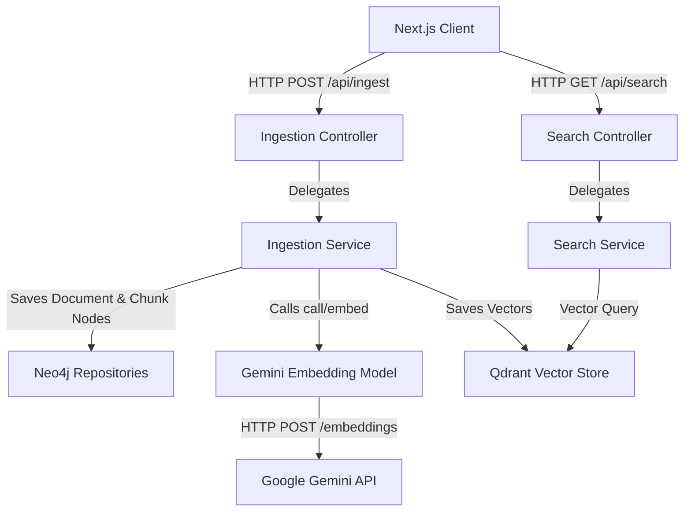

# Project Workflow & Architecture Guide: Semantic Retrieval System

This guide provides a comprehensive, file-by-file, and code-by-code breakdown of the **Semantic Retrieval System**. It is structured to help you explain the architecture and execution flow in detail during an interview.

---

## 1. System Architecture & Component Overview

The system is a **Hybrid RAG (Retrieval-Augmented Generation) Backend** that combines:
1. **Vector Database (Qdrant)**: Performs semantic search on high-dimensional dense vector embeddings of text chunks.
2. **Graph Database (Neo4j)**: Stores structured hierarchical relationships between documents and their constituent text chunks, enabling relationship traversal.
3. **Large Language Model (Google Gemini)**: Generates text embeddings using the `gemini-embedding-001` model via OpenAI-compatible endpoints.



---

## 2. Code-by-Code & File-by-File Breakdown

### A. Infrastructure & Configuration

#### 1. [docker-compose.yml](file:///Users/prathmesh/Desktop/Projects/SemanticRetrivalSystem/docker-compose.yml)
Defines the multi-container database environment.
```yaml
services:
  qdrant:
    image: qdrant/qdrant
    container_name: qdrant
    ports:
      - "6333:6333" # HTTP REST API & Web Dashboard
      - "6334:6334" # gRPC Interface (used by Spring AI Client)
    volumes:
      - ./qdrant_storage:/qdrant/storage:z
...
  neo4j:
    image: neo4j:5.15.0
    container_name: neo4j
    ports:
      - "7474:7474" # Neo4j Browser Console (HTTP)
      - "7687:7687" # Bolt Protocol (Binary connection used by Spring)
    environment:
      - NEO4J_AUTH=neo4j/password
```
*   **What this does**: Spins up Qdrant (Vector DB) and Neo4j (Graph DB) locally. Spring Boot connects to Qdrant via gRPC (port `6334`) and Neo4j via Bolt (port `7687`).

#### 2. [backend/src/main/resources/application.properties](file:///Users/prathmesh/Desktop/Projects/SemanticRetrivalSystem/backend/src/main/resources/application.properties)
Configures connection parameters and API settings.
```properties
# Connect to Neo4j
spring.neo4j.uri=bolt://localhost:7687
spring.neo4j.authentication.username=neo4j
spring.neo4j.authentication.password=password

# Connect to Qdrant (Spring AI Starter)
spring.ai.vectorstore.qdrant.host=localhost
spring.ai.vectorstore.qdrant.port=6334
spring.ai.vectorstore.qdrant.collection-name=documents

# Point OpenAI Client to Gemini's compatibility base url
spring.ai.openai.base-url=https://generativelanguage.googleapis.com/v1beta/openai/
spring.ai.openai.api-key=${GEMINI_API_KEY:temporary-dummy-key}
spring.ai.openai.embedding.options.model=gemini-embedding-001
```
*   **What this does**: Directs Spring Boot to connect to the databases. Redirects the OpenAI-compatible client library to communicate directly with Google Gemini endpoints (`generativelanguage.googleapis.com`) using your `GEMINI_API_KEY` (with a dummy key fallback on startup to prevent boot errors).

---

### B. Domain Models (Object-Graph Mapping in Neo4j)

The database schema maps a document into a parent `Document` node connected to multiple `Chunk` nodes in Neo4j, representing hierarchical text separation.

#### 3. [Document.java](file:///Users/prathmesh/Desktop/Projects/SemanticRetrivalSystem/backend/src/main/java/com/example/semanticretrieval/domain/Document.java)
```java
@Node
public class Document {
    @Id
    @GeneratedValue
    private Long id;

    private String title;
    private String content;

    @Relationship(type = "HAS_CHUNK", direction = Relationship.Direction.OUTGOING)
    private List<Chunk> chunks = new ArrayList<>();
    
    // Getters and Setters
}
```
*   **What this does**: Declares the `@Node` representation in Neo4j. Outlines the relationship: a Document has outgoing `HAS_CHUNK` edges to a collection of `Chunk` nodes.

#### 4. [Chunk.java](file:///Users/prathmesh/Desktop/Projects/SemanticRetrivalSystem/backend/src/main/java/com/example/semanticretrieval/domain/Chunk.java)
```java
@Node
public class Chunk {
    @Id
    @GeneratedValue
    private Long id;

    private String content;
    private int index;
    private String embeddingId; // Correlation key matching Qdrant
    
    // Getters and Setters
}
```
*   **What this does**: Represents a text fragment. Crucially, `embeddingId` holds a UUID generated during ingestion. This ID is shared between Neo4j and Qdrant, acting as the bridge linking the graph node with the corresponding vector index.

---

### C. Custom Integration Layer (Gemini Embedding Generation)

#### 5. [GeminiEmbeddingModel.java](file:///Users/prathmesh/Desktop/Projects/SemanticRetrivalSystem/backend/src/main/java/com/example/semanticretrieval/config/GeminiEmbeddingModel.java)
Overrides Spring AI's auto-configuration to construct a direct, custom REST client matching Google Gemini's OpenAI-compatible JSON payload requirements.
```java
@Component
@Primary
public class GeminiEmbeddingModel implements EmbeddingModel {

    private final HttpClient httpClient = HttpClient.newHttpClient();
    private final ObjectMapper objectMapper = new ObjectMapper();

    @Value("${spring.ai.openai.api-key}")
    private String apiKey;

    @Value("${spring.ai.openai.base-url}")
    private String baseUrl;

    @Value("${spring.ai.openai.embedding.options.model:gemini-embedding-001}")
    private String modelName;

    @Override
    public EmbeddingResponse call(EmbeddingRequest request) {
        try {
            List<String> inputs = request.getInstructions();

            // 1. Construct OpenAI/Gemini compatible payload
            Map<String, Object> requestBody = new HashMap<>();
            requestBody.put("model", modelName);
            requestBody.put("input", inputs);

            String jsonRequest = objectMapper.writeValueAsString(requestBody);
            URI uri = URI.create(baseUrl + (baseUrl.endsWith("/") ? "" : "/") + "embeddings");

            // 2. Build HTTP POST Request
            HttpRequest httpRequest = HttpRequest.newBuilder()
                    .uri(uri)
                    .header("Content-Type", "application/json")
                    .header("Authorization", "Bearer " + apiKey)
                    .POST(HttpRequest.BodyPublishers.ofString(jsonRequest))
                    .build();

            // 3. Fire request to Gemini API
            HttpResponse<String> httpResponse = httpClient.send(httpRequest, HttpResponse.BodyHandlers.ofString());

            // 4. Parse response list of float arrays (embeddings)
            Map<String, Object> responseMap = objectMapper.readValue(httpResponse.body(), Map.class);
            List<Map<String, Object>> data = (List<Map<String, Object>>) responseMap.get("data");

            List<Embedding> embeddings = new ArrayList<>();
            for (int i = 0; i < data.size(); i++) {
                Map<String, Object> item = data.get(i);
                List<Number> vectorList = (List<Number>) item.get("embedding");
                List<Double> doubleVector = vectorList.stream().map(Number::doubleValue).toList();
                embeddings.add(new Embedding(doubleVector, i));
            }

            return new EmbeddingResponse(embeddings, new EmbeddingResponseMetadata());
        } catch (Exception e) {
            throw new RuntimeException("Error during embedding generation", e);
        }
    }
}
```
*   **What this does**: Intercepts request to embed text, transforms it into a standard JSON payload (`{"model": "gemini-embedding-001", "input": [...]}`), posts it to Gemini's endpoint, and parses the response vectors into Spring AI `Embedding` instances.

---

### D. Business Logic Services (Orchestrators)

#### 6. [IngestionService.java](file:///Users/prathmesh/Desktop/Projects/SemanticRetrivalSystem/backend/src/main/java/com/example/semanticretrieval/service/IngestionService.java)
Coordinates transaction-safe database persistence across Neo4j and Qdrant.
```java
@Service
public class IngestionService {

    private final VectorStore vectorStore;
    private final DocumentRepository documentRepository;

    public IngestionService(VectorStore vectorStore, DocumentRepository documentRepository) {
        this.vectorStore = vectorStore;
        this.documentRepository = documentRepository;
    }

    @Transactional("transactionManager")
    public void ingestDocument(String title, String content) {
        // 1. Create parent Document entity
        Document doc = new Document();
        doc.setTitle(title);
        doc.setContent(content);

        // 2. Perform document chunking (splits by double newline)
        String[] textChunks = content.split("\n\n");
        List<org.springframework.ai.document.Document> aiDocuments = new ArrayList<>();

        for (int i = 0; i < textChunks.length; i++) {
            String text = textChunks[i];
            if (text.trim().isEmpty()) continue;

            // 3. Create child Neo4j Chunk entity
            Chunk chunk = new Chunk();
            chunk.setContent(text);
            chunk.setIndex(i);

            // Assign unique ID for correlation between databases
            String vectorId = UUID.randomUUID().toString();
            chunk.setEmbeddingId(vectorId);

            // Attach chunk to Document node (creates relationship list)
            doc.getChunks().add(chunk);

            // 4. Prepare Spring AI Document for Qdrant storage
            org.springframework.ai.document.Document aiDoc = new org.springframework.ai.document.Document(text);
            aiDoc.getMetadata().put("doc_title", title);
            aiDoc.getMetadata().put("chunk_index", i);
            aiDoc.getMetadata().put("embedding_id", vectorId); // Match the graph ID

            aiDocuments.add(aiDoc);
        }

        // 5. Save graph nodes into Neo4j
        documentRepository.save(doc);

        // 6. Save text chunks and vectors into Qdrant
        // This implicitly calls GeminiEmbeddingModel.call() to retrieve embeddings first
        vectorStore.add(aiDocuments);
    }
}
```
*   **What this does**: Orchestrates the dual-persistence flow. First splits input text into paragraph chunks, assigns UUIDs to tie Neo4j Chunks and Qdrant vectors together, persists the document-chunk tree into Neo4j, and writes the text with its generated embeddings to Qdrant.

#### 7. [SearchService.java](file:///Users/prathmesh/Desktop/Projects/SemanticRetrivalSystem/backend/src/main/java/com/example/semanticretrieval/service/SearchService.java)
Queries the vector database for nearest semantic neighbors.
```java
@Service
public class SearchService {

    private final VectorStore vectorStore;

    public SearchService(VectorStore vectorStore) {
        this.vectorStore = vectorStore;
    }

    public List<String> search(String query) {
        // 1. Vector Search (similarity search in Qdrant)
        List<org.springframework.ai.document.Document> similarDocuments = vectorStore
                .similaritySearch(SearchRequest.query(query).withTopK(5));
 
        // 2. Extract content and enrich with Graph Data from Neo4j (Hybrid Search)
        return similarDocuments.stream()
                .map(doc -> {
                    String content = doc.getContent();
                    String embeddingId = (String) doc.getMetadata().get("embedding_id");
 
                    if (embeddingId != null) {
                        Optional<Document> parentDocOpt = documentRepository.findByChunkEmbeddingId(embeddingId);
                        if (parentDocOpt.isPresent()) {
                            Document parentDoc = parentDocOpt.get();
                            return "From Document [" + parentDoc.getTitle() + "]: " + content;
                        }
                    }
 
                    // Fallback to vector store metadata
                    String docTitle = (String) doc.getMetadata().get("doc_title");
                    if (docTitle != null) {
                        return "From [" + docTitle + "] (Vector fallback): " + content;
                    }
                    return content;
                })
                .collect(Collectors.toList());
    }
}
```
*   **What this does**: Calls `vectorStore.similaritySearch(query)`. Under the hood, Spring AI embeds the query via `GeminiEmbeddingModel` and returns the top 5 closest chunks stored in Qdrant based on Cosine Similarity metrics.

---

### E. Frontend Interaction (Next.js client-side UI)

#### 8. [frontend/src/app/page.tsx](file:///Users/prathmesh/Desktop/Projects/SemanticRetrivalSystem/frontend/src/app/page.tsx)
Handles the user interface for query execution and results rendering.
```typescript
  const handleSearch = async (e: React.FormEvent) => {
    e.preventDefault();
    if (!query.trim()) return;
 
    setLoading(true);
    setError("");
    setResults([]);
 
    try {
      // Fire GET request to Spring Boot Search API
      const response = await axios.get(`http://localhost:8080/api/search`, {
        params: { query },
      });
      setResults(response.data);
    } catch (err: any) {
      console.error(err);
      const msg = err.response?.data?.error || err.response?.data?.message || err.message || "Failed to fetch results. Is the backend running?";
      setError(msg);
    } finally {
      setLoading(false);
    }
  };
```
*   **What this does**: Sends requests to the Spring Boot REST endpoint and processes the returned list of text strings, rendering them within styled glassmorphic cards.

#### 9. [frontend/src/app/ingest/page.tsx](file:///Users/prathmesh/Desktop/Projects/SemanticRetrivalSystem/frontend/src/app/ingest/page.tsx)
Handles data collection from users to feed the backend.
```typescript
const handleIngest = async (e: React.FormEvent) => {
    e.preventDefault();
    if (!title.trim() || !content.trim()) return;
 
    setLoading(true);
    setStatus("idle");
    setErrorMessage("");
 
    try {
        // Fire POST request to Spring Boot Ingestion API
        await axios.post(`http://localhost:8080/api/ingest`, { title, content });
        setStatus("success");
        setTitle("");
        setContent("");
    } catch (err: any) {
        setStatus("error");
        const msg = err.response?.data?.error || err.response?.data?.message || err.message || "Failed to ingest.";
        setErrorMessage(msg);
    } finally {
        setLoading(false);
    }
};
```
*   **What this does**: Sends document metadata (`title`) and full text body (`content`) as a JSON payload to `/api/ingest` to execute the dual-database ingestion workflow, displaying structured error notifications in the UI on exception.
 
#### 10. [TutorialPanel.tsx](file:///Users/prathmesh/Desktop/Projects/SemanticRetrivalSystem/frontend/src/components/TutorialPanel.tsx)
Renders a step-by-step interactive sidebar tutorial that lets users learn core search pipeline concepts, trigger auto-ingestion of sample articles, and perform semantic queries with a single click.
 
---

## 3. How Neo4j and Qdrant Interact (Hybrid Mechanism & Code Flow)

Neo4j and Qdrant do not communicate with each other directly at the database layer. Instead, **the Spring Boot application acts as the mediator** that links them. 

The integration relies on a **correlation key** (`embeddingId` / UUID) shared between both systems:

```
                  [Raw Document Content]
                            │
                            ▼
                  (1. Split into Chunks)
                            │
                  ┌─────────┴─────────┐
                  ▼                   ▼
             [Chunk Text]        [UUID Generated]
             "Project..."        "3e5c92d0-..."
                  │                   │
                  ├───────────────────┤
                  ▼                   ▼
             [Save to Neo4j]      [Save to Qdrant]
             Store as Node        Store with Vector
```

### A. The Ingestion Correlation Flow
In [IngestionService.java](file:///Users/prathmesh/Desktop/Projects/SemanticRetrivalSystem/backend/src/main/java/com/example/semanticretrieval/service/IngestionService.java):
1. **UUID is generated:**
   ```java
   String vectorId = UUID.randomUUID().toString();
   ```
2. **Linked to Neo4j Entity:**
   ```java
   Chunk chunk = new Chunk();
   chunk.setEmbeddingId(vectorId); // Graph Node Property
   ```
3. **Linked to Qdrant Vector Payload:**
   ```java
   org.springframework.ai.document.Document aiDoc = new org.springframework.ai.document.Document(text);
   aiDoc.getMetadata().put("embedding_id", vectorId); // Metadata Payload in Vector DB
   ```

### B. The Hybrid Search & Retrieval Flow (Expansion Concept)
By linking them via this UUID, you can implement a true **hybrid search** in [SearchService.java](file:///Users/prathmesh/Desktop/Projects/SemanticRetrivalSystem/backend/src/main/java/com/example/semanticretrieval/service/SearchService.java) to retrieve connected graph details:

```java
public List<String> searchHybrid(String query) {
    // 1. Ask Qdrant to find semantically matching vector points
    List<org.springframework.ai.document.Document> vectorMatches = vectorStore
            .similaritySearch(SearchRequest.query(query).withTopK(3));

    return vectorMatches.stream()
            .map(doc -> {
                // 2. Extract correlation UUID from Qdrant metadata
                String embeddingId = (String) doc.getMetadata().get("embedding_id");
                
                // 3. Query Neo4j to find linked graph nodes and expand context
                Optional<Chunk> graphChunk = chunkRepository.findByEmbeddingId(embeddingId);
                
                if (graphChunk.isPresent()) {
                    // Traverse relationships in the graph (e.g. parent document)
                    return "Graph Verified Match: " + graphChunk.get().getContent();
                }
                return "Vector Only Match: " + doc.getContent();
            })
            .collect(Collectors.toList());
}
```

---

## 4. End-to-End Execution Trace

### Flow A: Ingesting "Project Hyperion"
1. User enters: Title = `"Project Hyperion"`, Content = `"Project Hyperion was started in 2026.\n\nIt aims to build carbon-nanotube sails."`
2. **React Client** POSTs to `http://localhost:8080/api/ingest` via [IngestionController.java](file:///Users/prathmesh/Desktop/Projects/SemanticRetrivalSystem/backend/src/main/java/com/example/semanticretrieval/controller/IngestionController.java#L26).
3. **[IngestionService.java](file:///Users/prathmesh/Desktop/Projects/SemanticRetrivalSystem/backend/src/main/java/com/example/semanticretrieval/service/IngestionService.java#L30)**:
   * Instantiates `Document` node.
   * Splits into two chunks:
     * Chunk 0: `"Project Hyperion was started in 2026."` $\rightarrow$ sets `embeddingId = "uuid-1"`.
     * Chunk 1: `"It aims to build carbon-nanotube sails."` $\rightarrow$ sets `embeddingId = "uuid-2"`.
   * Saves to **Neo4j** via `documentRepository.save(doc)`, creating the graph:
     `(:Document {title: "Project Hyperion"}) -[:HAS_CHUNK]-> (:Chunk {content: "...", embeddingId: "uuid-1"})`
   * Sends the chunks to `vectorStore.add()`.
4. **[GeminiEmbeddingModel.java](file:///Users/prathmesh/Desktop/Projects/SemanticRetrivalSystem/backend/src/main/java/com/example/semanticretrieval/config/GeminiEmbeddingModel.java#L40)** receives the text arrays, queries Google Gemini Embeddings endpoint, and returns two $768$-dimensional float vector arrays.
5. **Spring AI Qdrant Starter** uploads these vector arrays to the `documents` collection in **Qdrant**, storing the vector representation along with payload details containing `embedding_id` (`uuid-1` & `uuid-2`).

---

### Flow B: Searching "How will Hyperion sail?"
1. User enters: `"How will Hyperion sail?"` into search.
2. **React Client** queries `http://localhost:8080/api/search?query=How will Hyperion sail?`.
3. **[SearchService.java](file:///Users/prathmesh/Desktop/Projects/SemanticRetrivalSystem/backend/src/main/java/com/example/semanticretrieval/service/SearchService.java#L19)** initiates vector search:
   * Requests query embedding from `GeminiEmbeddingModel`.
   * Sends the query vector to **Qdrant** via gRPC on port `6334`.
   * **Qdrant** calculates Cosine Similarity between query vector and stored vectors, returning the top match (which matches Chunk 1 `"It aims to build carbon-nanotube sails."`).
4. `SearchService` extracts content strings and returns them to the user via the `SearchController`.

---

## 5. Key Architectural Highlights for the Interview

1. **Graph + Vector Hybrid Synergy**:
   *   *Qdrant* solves the "unstructured similarity" problem: finding semantically related concepts even if they use different keywords.
   *   *Neo4j* solves the "structured connection" problem: once a chunk is matched in Qdrant, we can use the `embeddingId` to locate the node in Neo4j, traverse its relationships (like `HAS_CHUNK`), retrieve the parent document, or fetch other associated entities (like tags, authors, or related items).
2. **OpenAI compatibility of Google Gemini**:
   *   Leverages the OpenAI-compatible endpoint of Google Gemini (`generativelanguage.googleapis.com/v1beta/openai/`) inside Spring AI.
   *   Ensures that standard REST clients or Spring AI abstractions can integrate Google Gemini's embedding capability with minimal modification.
3. **Decoupled OGM/Vector Correlation**:
   *   By using a UUID string (`embeddingId`) in both Neo4j and the vector store's metadata, the application decouples the database transaction boundaries while preserving link integrity between structured graph records and unstructured vector indices.
