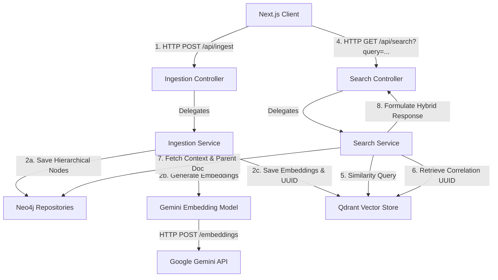

# The Ultimate Technical Interview Guide: Semantic Retrieval System

This document is your master cheat sheet and preparation guide to cracking technical interviews based on the **Semantic Retrieval System** project. It details the system architecture, file-by-file logic, deep database structures, vector mathematics, system scaling strategies, and quick-fire Q&As.

---

## 1. The 60-Second Elevator Pitch (Tell Me About Your Project)

> **Interviewer**: *"Can you walk me through the most recent project on your resume?"*
>
> **Your Answer**:
> *"I designed and built a **Hybrid Semantic Retrieval System** that combines **Vector Similarity Search** and **Graph-structured Knowledge Networks** to solve the multi-hop reasoning limitations of standard vector search. 
> 
> The application uses **Next.js** on the frontend and a **Spring Boot** microservice on the backend. When a document is ingested, it is parsed and chunked. I utilized **Google Gemini (`gemini-embedding-001`)** via custom HTTP integration to generate 768-dimensional semantic embeddings. The embeddings are stored in **Qdrant** (a dedicated vector database) for fast spatial similarity lookups, while the original document structure and chunk hierarchies are stored in **Neo4j** (a graph database). 
> 
> The core technical highlight is a **decoupled dual-persistence pipeline**: both databases are synchronized using a shared correlation UUID. During retrieval, we perform a vector search in Qdrant to find relevant concepts, extract the UUID, and immediately query Neo4j using custom **Cypher** queries to traverse parent documents and associated graph structures. This hybrid architecture serves as the robust retrieval engine necessary to support advanced Retrieval-Augmented Generation (RAG) pipelines without keyword matching bottlenecks."*

---

## 2. System Architecture & Tech Stack Justifications

### System Flow Diagram


### Tech Stack Decisions: Why This Architecture?

An interviewer will test your ability to make technical trade-offs. Be prepared to explain:

#### 1. Why a Hybrid System (Vector + Graph) instead of Pure Vector Search?
*   **The Problem with Pure Vector Search (Dense Retrieval)**: Vector embeddings map semantic meaning, but they fail at relational reasoning. If Document A says *"Dr. Aris Thorne created the Hyperion engine"* and Document B says *"Dr. Aris Thorne patented a room-temperature superconductor"*, a query like *"What did the creator of Hyperion patent?"* fails in pure vector search. The term "Hyperion" has low semantic similarity to "superconductor."
*   **The Hybrid Solution**: Vector search finds the entry point (Document A), identifies the entity (`Dr. Aris Thorne`), and the Knowledge Graph traverses the relationship: `[Hyperion] -> (CREATED_BY) -> [Thorne] -> (PATENTED) -> [Superconductor]`.

#### 2. Why Qdrant and Neo4j separately instead of Postgres with pgvector?
*   **Qdrant** is a dedicated Rust-based vector database. It supports advanced HNSW (Hierarchical Navigable Small World) indexing out-of-the-box, scalar quantization, and payloads filtering at millisecond speeds.
*   **Neo4j** is a native graph database optimized for pointer-chasing and multi-hop relationship traversals (using Cypher) without heavy relational JOIN performance penalties.
*   *Trade-off*: Using two databases increases operational overhead and requires us to manage application-level synchronization (the "dual-write" problem), whereas a unified database like Postgres (`pgvector` + relational tables) simplifies transactions but scales poorly under high-dimensional vector search volumes and deep relationship queries.

---

## 3. Database Schema & Object-Graph Mapping (OGM)

### Neo4j Graph Model
We model documents hierarchically. A parent `Document` node has outgoing relations (`HAS_CHUNK`) pointing to several `Chunk` nodes.

```
(:Document {id, title, content})
       │
  [:HAS_CHUNK]
       ▼
(:Chunk {id, content, index, embeddingId})
```

#### Graph Class Mappings (Java Spring Data Neo4j)
*   **`@Node`**: Declares that a class maps directly to a Neo4j node label.
*   **`@Relationship`**: Configures relationship type (`HAS_CHUNK`) and direction (`OUTGOING`).
*   **Correlation Key (`embeddingId`)**: A UUID generated during ingestion. It is stored as a node property in Neo4j and as payload metadata in Qdrant. This bridges both storage engines.

---

## 4. Code-by-Code Annotated Walkthrough

### A. Core Configuration & Custom Gemini API Integration
#### File: [GeminiEmbeddingModel.java](file:///Users/prathmesh/Desktop/Projects/SemanticRetrivalSystem/backend/src/main/java/com/example/semanticretrieval/config/GeminiEmbeddingModel.java)

*Why did we build this?* Spring AI's auto-configuration targets OpenAI endpoints directly. Since Google Gemini provides an OpenAI-compatible API pathway, we implemented `EmbeddingModel` and overrode the `call` method. This allows us to manually handle payload serialization, HTTP networking via Java's native `HttpClient`, and JSON mapping with Jackson `ObjectMapper`.

```java
@Component
@Primary // Marks this as the default bean for VectorStore to resolve auto-wiring conflicts
public class GeminiEmbeddingModel implements EmbeddingModel {

    private final HttpClient httpClient = HttpClient.newHttpClient();
    private final ObjectMapper objectMapper = new ObjectMapper();

    @Value("${spring.ai.openai.api-key}")
    private String apiKey;

    @Value("${spring.ai.openai.base-url}")
    private String baseUrl;

    @Value("${spring.ai.openai.embedding.options.model:gemini-embedding-001}")
    private String modelName;

    @Override
    public EmbeddingResponse call(EmbeddingRequest request) {
        try {
            // Extract raw text segments to embed
            List<String> inputs = request.getInstructions();

            // Formulate standard OpenAI/Gemini JSON Request Payload:
            // { "model": "gemini-embedding-001", "input": ["text1", "text2"] }
            Map<String, Object> requestBody = new HashMap<>();
            requestBody.put("model", modelName);
            requestBody.put("input", inputs);

            String jsonRequest = objectMapper.writeValueAsString(requestBody);
            URI uri = URI.create(baseUrl + (baseUrl.endsWith("/") ? "" : "/") + "embeddings");

            // Construct HTTP POST request with Authorization headers
            HttpRequest httpRequest = HttpRequest.newBuilder()
                    .uri(uri)
                    .header("Content-Type", "application/json")
                    .header("Authorization", "Bearer " + apiKey)
                    .POST(HttpRequest.BodyPublishers.ofString(jsonRequest))
                    .build();

            // Synchronously dispatch to Google Gemini
            HttpResponse<String> httpResponse = httpClient.send(httpRequest, HttpResponse.BodyHandlers.ofString());

            // Parse response body containing float arrays inside the "data" structure
            Map<String, Object> responseMap = objectMapper.readValue(httpResponse.body(), Map.class);
            List<Map<String, Object>> data = (List<Map<String, Object>>) responseMap.get("data");

            List<Embedding> embeddings = new ArrayList<>();
            for (int i = 0; i < data.size(); i++) {
                Map<String, Object> item = data.get(i);
                List<Number> vectorList = (List<Number>) item.get("embedding");
                List<Double> doubleVector = vectorList.stream().map(Number::doubleValue).toList();
                embeddings.add(new Embedding(doubleVector, i));
            }

            return new EmbeddingResponse(embeddings, new EmbeddingResponseMetadata());
        } catch (Exception e) {
            throw new RuntimeException("Error generating Gemini embedding vectors", e);
        }
    }
}
```

> **Interviewer Focus Point**: *Why `@Primary`?*
> **Answer**: *If another `EmbeddingModel` bean (like an auto-configured OpenAI model) is on the classpath, Spring's Dependency Injection container throws an `AmbiguousBeanException`. Marking our custom Gemini model as `@Primary` instructs Spring to resolve our custom implementation as the default.*

---

### B. Ingestion Pipeline & Dual Database Write
#### File: [IngestionService.java](file:///Users/prathmesh/Desktop/Projects/SemanticRetrivalSystem/backend/src/main/java/com/example/semanticretrieval/service/IngestionService.java)

This service orchestrates the step-by-step data ingestion flow, splitting the document body, binding the shared UUID (`embeddingId`), and writing to Neo4j and Qdrant.

```java
@Service
public class IngestionService {

    private final VectorStore vectorStore;
    private final DocumentRepository documentRepository;

    public IngestionService(VectorStore vectorStore, DocumentRepository documentRepository) {
        this.vectorStore = vectorStore;
        this.documentRepository = documentRepository;
    }

    @Transactional("transactionManager") // Ensures relational database/graph consistency within Spring context
    public void ingestDocument(String title, String content) {
        // 1. Initialize parent document graph node
        Document doc = new Document();
        doc.setTitle(title);
        doc.setContent(content);

        // 2. Chunking strategy: split on double newlines to segment paragraphs
        String[] textChunks = content.split("\n\n");
        List<org.springframework.ai.document.Document> aiDocuments = new ArrayList<>();

        for (int i = 0; i < textChunks.length; i++) {
            String text = textChunks[i];
            if (text.trim().isEmpty()) continue;

            // Create Neo4j Chunk entity
            Chunk chunk = new Chunk();
            chunk.setContent(text);
            chunk.setIndex(i);

            // Generate shared correlation ID (UUID)
            String vectorId = UUID.randomUUID().toString();
            chunk.setEmbeddingId(vectorId);

            // Attach chunk to Document node (defines HAS_CHUNK relationship)
            doc.getChunks().add(chunk);

            // Create Spring AI Document wrapper to store in Qdrant
            org.springframework.ai.document.Document aiDoc = new org.springframework.ai.document.Document(text);
            aiDoc.getMetadata().put("doc_title", title);
            aiDoc.getMetadata().put("chunk_index", i);
            aiDoc.getMetadata().put("embedding_id", vectorId); // Matches Neo4j property

            aiDocuments.add(aiDoc);
        }

        // 3. Save graph structure to Neo4j
        documentRepository.save(doc);

        // 4. Save to Qdrant (Automatically triggers custom GeminiEmbeddingModel to get embeddings)
        vectorStore.add(aiDocuments);
    }
}
```

---

### C. Search & Hybrid Retrieval Pipeline
#### File: [SearchService.java](file:///Users/prathmesh/Desktop/Projects/SemanticRetrivalSystem/backend/src/main/java/com/example/semanticretrieval/service/SearchService.java)

Retrieval maps unstructured query parameters to dense spatial vectors, executes searches in Qdrant, parses metadata properties, and performs lookups inside Neo4j.

```java
@Service
public class SearchService {

    private final VectorStore vectorStore;
    private final DocumentRepository documentRepository;

    public SearchService(VectorStore vectorStore, DocumentRepository documentRepository) {
        this.vectorStore = vectorStore;
        this.documentRepository = documentRepository;
    }

    public List<String> search(String query) {
        // 1. Run similarity search in Qdrant (fetches top 5 matching text chunks)
        List<org.springframework.ai.document.Document> similarDocuments = vectorStore
                .similaritySearch(SearchRequest.query(query).withTopK(5));

        // 2. Resolve hybrid context: query Neo4j for metadata & parental relationships
        return similarDocuments.stream()
                .map(doc -> {
                    String content = doc.getContent();
                    String embeddingId = (String) doc.getMetadata().get("embedding_id");

                    if (embeddingId != null) {
                        // Graph traversal lookup using custom repository method
                        Optional<Document> parentDocOpt = documentRepository.findByChunkEmbeddingId(embeddingId);
                        if (parentDocOpt.isPresent()) {
                            Document parentDoc = parentDocOpt.get();
                            return "From Document [" + parentDoc.getTitle() + "]: " + content;
                        }
                    }

                    // Fallback to vector payload metadata if Neo4j query fails
                    String docTitle = (String) doc.getMetadata().get("doc_title");
                    if (docTitle != null) {
                        return "From [" + docTitle + "] (Vector fallback): " + content;
                    }
                    return content;
                })
                .collect(Collectors.toList());
    }
}
```

#### Custom Repository Cypher Query: [DocumentRepository.java](file:///Users/prathmesh/Desktop/Projects/SemanticRetrivalSystem/backend/src/main/java/com/example/semanticretrieval/repository/DocumentRepository.java)
```java
@Repository
public interface DocumentRepository extends Neo4jRepository<Document, Long> {

    @Query("MATCH (d:Document)-[:HAS_CHUNK]->(c:Chunk) WHERE c.embeddingId = $embeddingId RETURN d")
    Optional<Document> findByChunkEmbeddingId(String embeddingId);
}
```
*   **How it works**: This Cypher statement matches the parent `Document` (`d`) connected via `HAS_CHUNK` to a target `Chunk` (`c`) where the chunk's `embeddingId` property matches the correlation key. It avoids loading all document-chunk networks into RAM, retrieving only the required node.

---

## 5. Understanding the Correlation Mechanism

Because Neo4j (Graph DB) and Qdrant (Vector DB) are separate databases, they do not have foreign key constraints or automatic cascade transactions between them. The **Spring Boot application serves as the mediator** that links them.

```
                           +------------------------+
                           | Ingestion Flow Initer  |
                           +-----------+------------+
                                       |
                     [Raw text: "Semantic Retrieval Systems..."]
                                       |
                                       v
                    1. Generate Correlation ID (UUID)
                           "3e5c92d0-a9b8-472d"
                                       |
                     +-----------------+-----------------+
                     |                                   |
                     v                                   v
             2a. Save to Neo4j                   2b. Save to Qdrant
         - Node Label: :Chunk                - Point: Vector Embeddings
         - Content: "Semantic..."            - Payload: {
         - Property:                           "embedding_id": "3e5c92d0..."
           "embeddingId": "3e5c92d0..."      }
```

During Search:
1. Qdrant performs similarity search, returning the chunk text and metadata.
2. The code extracts `embedding_id` from the Qdrant metadata payload.
3. The code calls Neo4j: `MATCH (d:Document)-[:HAS_CHUNK]->(c:Chunk) WHERE c.embeddingId = $id RETURN d`.
4. This binds unstructured vector similarity with rich, structured relational knowledge graphs.

---

## 6. Vector Search & Embedding Theory

### The Math of Similarity Metrics

When an embedding model generates vectors, they are positioned inside a high-dimensional vector space. The proximity between vectors is measured using three mathematical equations:

#### 1. Cosine Similarity
Measures the cosine of the angle between two multi-dimensional vectors. It evaluates directional similarity rather than magnitude.
$$\text{Similarity}(A, B) = \cos(\theta) = \frac{A \cdot B}{\|A\| \|B\|} = \frac{\sum_{i=1}^{n} A_i B_i}{\sqrt{\sum_{i=1}^{n} A_i^2} \sqrt{\sum_{i=1}^{n} B_i^2}}$$
*   **Scale**: -1 to +1 (or 0 to 1 for non-negative indices).
*   **Why use it**: Ideal when document lengths vary. A short sentence and a long paragraph discussing the same topic will align in direction, giving a high cosine score even if the magnitudes differ.

#### 2. Dot Product (Inner Product)
Multiplies corresponding elements of two vectors and sums them up.
$$\text{Dot Product}(A, B) = A \cdot B = \sum_{i=1}^{n} A_i B_i$$
*   **Why use it**: Extremely fast to calculate.
*   **Note**: If vectors are **normalized** (length/magnitude is 1.0), Cosine Similarity is equivalent to the Dot Product. **Google Gemini embedding vectors are normalized**, making Dot Product the optimal metric.

#### 3. Euclidean Distance ($L_2$ Distance)
Measures the straight-line distance between two points in Euclidean space.
$$d(A, B) = \sqrt{\sum_{i=1}^{n} (A_i - B_i)^2}$$
*   **Scale**: 0 to infinity (where lower values mean closer similarity).
*   **Why use it**: Ideal when absolute vector length contains meaning (e.g. classification tasks). Not preferred for text retrieval because different document lengths distort distance scores.

---

### Chunking Strategies: Visualized & Compared

Choosing how to split document files dictates the quality of downstream vector indexing:

| Chunking Strategy | Description | Pros | Cons |
| :--- | :--- | :--- | :--- |
| **Paragraph Splitting (`\n\n`)** | Splits text on natural double newlines. (Used in this project) | Maintains complete paragraphs; retains contextual unity. | Paragraph size is arbitrary; can exceed LLM context size or be too small. |
| **Fixed-Size (Character/Token)** | Splits text into exact windows (e.g., 500 characters). | Predictable sizing; standard memory boundaries. | Can split sentences or words in half, losing semantic meaning. |
| **Sliding Window (Overlap)** | Splits into fixed windows but overlaps blocks (e.g., 500 char size, 100 char overlap). | Preserves context across chunk boundaries. | Redundant data stored in vector DB; higher storage footprint. |
| **Semantic Chunking** | Uses an LLM or semantic variance calculations to split when the topic shifts. | High search precision; keeps coherent thoughts together. | High computing overhead during ingestion. |

---

## 7. System Design & Scale Interview Questions

These are advanced scenario questions designed to test your system design expertise.

### Q1: The Dual-Write Problem
> **Interviewer**: *"What happens if Neo4j succeeds but Qdrant fails during document ingestion? How do you keep the databases consistent?"*

*   **The Problem**: Our service performs two writes. If Qdrant experiences a network failure after Neo4j writes, we get a dangling Neo4j node that has no corresponding vector index. Spring's standard `@Transactional` database wrapper cannot roll back Qdrant (which doesn't support ACID transactions in sync with Java).
*   **The Solutions**:
    1.  **Transactional Outbox Pattern**: Instead of writing to Neo4j and Qdrant directly, write the document and a pending task event to a relational outbox table in Neo4j (or a shared DB) within an ACID transaction. A background scheduler (like Spring Integration or Debezium CDC) reads this table, pushes the vector task to a message broker, updates Qdrant, and marks the task as completed.
    2.  **Compensation / Retry Blocks**: Wrap the `vectorStore.add` call in a retry logic loop. If Qdrant fails permanently after retrying, trigger a compensatory write that deletes the parent document and chunk records from Neo4j, logging a structured rollback event.

---

### Q2: Scaling Ingestion to 1,000,000 Documents Daily
> **Interviewer**: *"How would you redesign this architecture to support ingesting one million documents per day?"*

*   **Redesign Elements**:
    1.  **Asynchronous Ingestion with Message Queues (Kafka/RabbitMQ)**:
        *   The web controller doesn't call `IngestionService` synchronously. Instead, it places the ingestion payload into a **Kafka** topic (`document-ingest`).
        *   Worker pools consume messages from Kafka, preventing backend web servers from running out of thread pools.
    2.  **Batching Vector API Requests**:
        *   Instead of calling Gemini API to embed chunks one-by-one, batch texts together (e.g., 100 chunks per request) to reduce network roundtrips and avoid rate limits.
    3.  **Qdrant Index Optimization**:
        *   Set Qdrant indexing to build asynchronously. During heavy ingestion, disable HNSW index building, stream all vectors into Qdrant, and enable HNSW rebuilding afterward.
        *   Use scalar quantization to compress 32-bit floating-point vectors to 8-bit integers, reducing RAM consumption by 75%.
    4.  **Clustering Databases**:
        *   Deploy Neo4j in a Causal Clustering configuration (one leader for writes, multiple read replicas).
        *   Scale Qdrant horizontally with multiple shards and replication factors.

---

### Q3: Building a True GraphRAG Engine
> **Interviewer**: *"How would you transition this basic correlation model into a true GraphRAG search engine?"*

```
[Raw Document] -> [Gemini Extraction] -> [Entity Nodes & Triplets] -> [Neo4j Graph]
                                                                        |
                                                                        v
[User Query]  -> [Vector Match in Qdrant] -> [Retrieve Entity Node] -> [Traverse Relationships]
```

*   **The Transition Plan**:
    1.  **Entity & Relationship Extraction**:
        *   During ingestion, feed text chunks into **Gemini 1.5 Flash** with a system prompt instructing it to extract entities (e.g., `Person`, `Technology`, `Organization`) and relationships (e.g., `INVENTED`, `EMPLOYED_BY`).
    2.  **Graph Construction**:
        *   Write Cypher statements to merge these entities as separate nodes and establish direct relationship edges in Neo4j, rather than just unstructured chunk paragraphs.
    3.  **Hybrid Retrieval Strategy**:
        *   When a user query comes in, perform vector search in Qdrant to retrieve the top matching entity nodes.
        *   Run a Cypher traversal to pull all entity paths within 2 hops (e.g., `MATCH (e:Entity)-[r*1..2]-(connected) WHERE e.id IN $matchedIds RETURN e, r, connected`).
        *   Format this structured subgraph as context and feed it, along with the user query, to **Gemini 1.5 Flash** to generate a highly detailed and contextual response.

---

## 8. Technical Q&As: Rapid-Fire Cheat Sheet

### Spring Boot Backend
1.  **What is the purpose of `@CrossOrigin` in your controllers?**
    *   It allows cross-origin requests from `http://localhost:3000` (Next.js frontend). Without it, modern browsers block HTTP requests due to CORS (Cross-Origin Resource Sharing) security policies.
2.  **What is `@Value` and how is it used here?**
    *   It injects configuration properties from `application.properties` or environment variables (e.g., `${spring.ai.openai.api-key}`) directly into Java class fields at runtime.
3.  **What is the default port for Spring Boot and how would you change it?**
    *   Default port is `8080`. You can change it by defining `server.port=9090` in `application.properties`.
4.  **Why use `@Transactional`?**
    *   It configures transaction boundaries for database operations. If an exception occurs within the method, Spring rolls back database modifications, preventing partial writes.
5.  **What is the difference between `@RestController` and `@Controller`?**
    *   `@RestController` is a convenience annotation that combines `@Controller` and `@ResponseBody`. It ensures that handler methods automatically serialize return values directly into HTTP response bodies as JSON instead of resolving MVC views.

### Neo4j & Cypher
6.  **What is Neo4j? How does it differ from PostgreSQL?**
    *   Neo4j is a Graph Database that stores data as Nodes, Relationships, and Properties. Postgres is a Relational Database that stores data in tables of rows and columns. Neo4j is optimized for navigating dense network relationships without using nested JOIN tables.
7.  **What are `@Node` and `@Relationship` in Spring Data Neo4j?**
    *   They are annotations used for Object-Graph Mapping (OGM). `@Node` maps a Java entity class to a Neo4j node label. `@Relationship` defines relationship edges between entities.
8.  **Explain this Cypher snippet: `MATCH (d:Document)-[:HAS_CHUNK]->(c:Chunk) RETURN d`.**
    *   It searches the database to find all nodes labeled `Document` (`d`) that have an outgoing relationship of type `HAS_CHUNK` pointing to a node labeled `Chunk` (`c`), and returns the document nodes.
9.  **What protocol does Spring Boot use to connect to Neo4j?**
    *   The Bolt Protocol (configured via `spring.neo4j.uri=bolt://localhost:7687`), which is Neo4j's proprietary binary protocol designed for high-performance query execution.
10. **How does Neo4j handle unique IDs?**
    *   We use `@GeneratedValue` on a `Long` id field to let Neo4j assign internal node IDs, while using a custom UUID string (`embeddingId`) to reference specific vector payloads.

### Qdrant & Vector Store
11. **What is Qdrant?**
    *   An open-source vector database written in Rust. It stores dense vectors along with metadata payloads, offering fast similarity searches via a gRPC interface.
12. **What is the default port configuration for Qdrant?**
    *   Port `6333` is for the HTTP REST API and the web dashboard interface. Port `6334` is for gRPC connections (which our Spring AI Qdrant Starter uses).
13. **What is an "Embedding"?**
    *   A numerical representation of unstructured text in a continuous, high-dimensional vector space. Embeddings are generated by machine learning models to capture the semantic meaning of words or sentences.
14. **How does similarity search work under the hood?**
    *   The search query is embedded into a vector. The vector database calculates the similarity score (like Cosine Similarity) between the query vector and all stored vectors using spatial indices (e.g. HNSW). It then returns the points with the highest score.
15. **What is the structure of a Qdrant Payload?**
    *   Payloads are key-value metadata maps associated with vector points. In this project, our payload contains: `doc_title`, `chunk_index`, and `embedding_id` (the correlation UUID).

### Next.js Frontend
16. **What is the difference between client components and server components in Next.js?**
    *   Client components (`"use client"`) are rendered on the client side, allowing you to use hooks (like `useState`, `useEffect`) and interactive event handlers. Server components are rendered on the server side, resulting in faster load times and better SEO by sending static HTML to the browser.
17. **What is Axios? Why use it instead of the native `fetch` API?**
    *   Axios is a promise-based HTTP client. It simplifies requests by automatically transforming JSON payloads, providing built-in timeout handling, and supporting request interceptors.
18. **How does page routing work in Next.js?**
    *   Next.js uses a file-system based router under the `src/app` directory. A folder (e.g. `src/app/ingest`) containing a `page.tsx` file automatically maps to the corresponding URL route (`/ingest`).
19. **What is the purpose of `useState` hook in Next.js pages?**
    *   It manages state local to the client-side component. For example, it tracks search queries, loading indicators, and search response datasets, updating the DOM when values change.
20. **Why do we need a dev server (`npm run dev`)?**
    *   It boots a local Node.js development server with hot-module replacement (HMR). When front-end source code changes, updates are instantly compiled and displayed in the browser.

---

## 9. Behavioral Interview Prep (The STAR Method)

> **Interviewer**: *"Tell me about a difficult technical challenge you faced while developing this project, and how you overcame it."*

*   **Situation**: *"While building the ingestion pipeline, I needed to integrate Google's Gemini Embedding Model with Spring AI. The standard Spring AI library did not have an out-of-the-box auto-configuration for Google's embedding model that matched our setup, resulting in schema serialization conflicts with the standard OpenAI-compatible endpoints."*
*   **Task**: *"I had to design a custom integration layer that would intercept document text arrays, format them into JSON payloads that met Google's REST specifications, and map the return vectors back into Spring AI's internal structures so that the rest of the application could function seamlessly."*
*   **Action**: *"I created a custom class `GeminiEmbeddingModel` implementing Spring AI's `EmbeddingModel` interface. I marked it as `@Primary` to override conflicting beans. Within it, I wrote manual mapping logic using Java's native `HttpClient` to dispatch HTTP POST requests, and used Jackson's `ObjectMapper` to parse the nested float arrays returned by Gemini. I configured the request to format payloads matching Gemini's OpenAI-compatibility endpoint (`/v1beta/openai/embeddings`)."*
*   **Result**: *"The custom integration resolved all serialization errors, allowing us to generate 768-dimensional embeddings via Gemini and ingest them directly into Qdrant. This approach preserved the standard Spring AI `VectorStore` API contracts, leaving our downstream indexing code intact and clean."*
