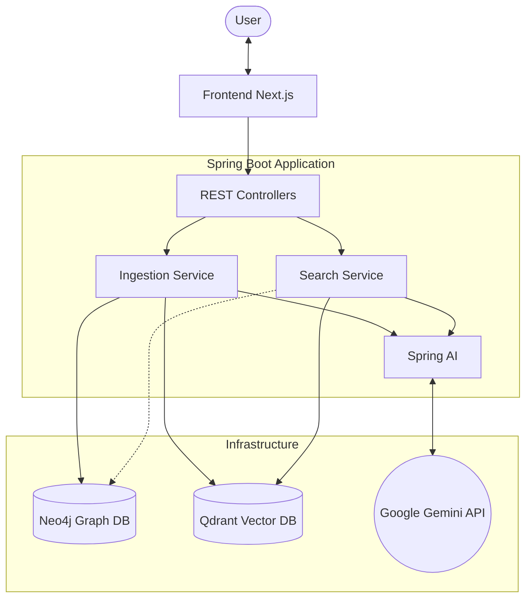
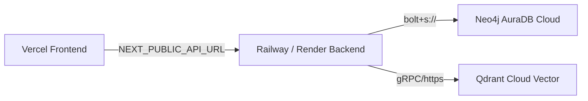

# Semantic Retrieval System

A high-performance hybrid search application that combines **Vector Search** (semantics) with **Knowledge Graph** (relationships) to provide highly accurate and context-aware search results.

## 🚀 Features

- **Hybrid Search**: Leverages both Vector Embeddings (Qdrant) for semantic understanding and Graph Database (Neo4j) for structured relationships.
- **Document Ingestion**: Parse and index documents into both vector and graph stores simultaneously.
- **Modern UI**: specialized interface built with Next.js 16 and Tailwind CSS for seamless user experience.
- **AI Integration**: Uses Google Gemini embeddings (via Spring AI and a custom robust embedding bean) to vectorize content.

## 🏗️ Architecture

The system follows a microservices-style architecture with a clear separation between the Next.js frontend and Spring Boot backend.



### 🔄 Workflows

#### 1. Data Ingestion Workflow
When a user ingests a document via the `/api/ingest` endpoint:
1.  **Receive**: The backend receives the `title` and `content`.
2.  **Chunk**: The content is split into smaller chunks (e.g., by paragraphs).
3.  **Embed**: `Spring AI` calls the Google Gemini API to generate vector embeddings for each chunk.
4.  **Graph Storage (Neo4j)**:
    -   A `Document` node is created.
    -   `Chunk` nodes are created and linked to the document via `HAS_CHUNK` relationships.
5.  **Vector Storage (Qdrant)**:
    -   Vectors are stored with metadata (content, doc_title, chunk_index).
    -   This enables semantic search capability.

#### 2. Semantic Search Workflow
When a user searches via the `/api/search` endpoint:
1.  **Receive**: The backend receives the natural language `query`.
2.  **Embed**: The query is converted into a vector embedding using Google Gemini.
3.  **Vector Search**: The system queries **Qdrant** for the nearest neighbor chunks (Cosine Similarity).
4.  **Retrieval**: Top-k matching chunks are retrieved.
5.  **Response**: The content of these chunks is returned to the frontend.
    -   *Future enhancement*: The system can use the chunk IDs to look up related nodes in Neo4j for "Hybrid Retrieval".

## 🛠 Tech Stack

### Backend
- **Framework**: Spring Boot 3.2
- **AI Integration**: Spring AI (1.0.0-M1) with a custom **GeminiEmbeddingModel**
- **Models**: Google Gemini 1.5 Flash (Chat) & gemini-embedding-001 (Embeddings)
- **Database (Graph)**: Neo4j (v5.15)
- **Database (Vector)**: Qdrant
- **Build Tool**: Maven
- **Language**: Java 17+ (Compiled and verified on Java 26+)

### Frontend
- **Framework**: Next.js 16 (App Router)
- **Language**: TypeScript
- **Styling**: Tailwind CSS
- **HTTP Client**: Axios
- **Icons**: Lucide React

## 📋 Prerequisites

Ensure you have the following installed:
- **Java 17+**
- **Node.js 18+**
- **Docker & Docker Compose** (for running databases)
- **Google Gemini API Key** (for generating embeddings)

## ⚡ Getting Started

### 1. Database Setup
Start the required databases (Neo4j and Qdrant) using Docker Compose.

```bash
docker-compose up -d
```

Verify containers are running:
- **Neo4j Dashboard**: [http://localhost:7474](http://localhost:7474) (Default login: `neo4j`/`password`)
- **Qdrant Dashboard**: [http://localhost:6333/dashboard](http://localhost:6333/dashboard)

### 2. Backend Setup
1. Navigate to the `backend` directory.
2. Configure your Google Gemini API Key.
   You can export it as an environment variable:
   ```bash
   export GEMINI_API_KEY=your_api_key_here
    # Windows PowerShell
    $env:GEMINI_API_KEY="your_api_key_here"
    ```
    *Note: `application.properties` utilizes `${GEMINI_API_KEY:temporary-dummy-key}` as a fallback to prevent Spring Boot startup validation crashes when no key is exported. However, a valid key is still required for runtime embedding generation.*
 
 3. Run the application:
   ```bash
   mvn spring-boot:run
   ```
   The backend will start on **http://localhost:8080**.

### 3. Frontend Setup
1. Navigate to the `frontend` directory.
   ```bash
   cd frontend
   ```
2. Install dependencies:
   ```bash
   npm install
   ```
3. Start the development server:
   ```bash
   npm run dev
   ```
   The application will be available at **http://localhost:3000**.

## 📖 Usage

### Search Interface
Visit `http://localhost:3000` to access the main search page. Enter natural language queries to retrieve results based on semantic meaning.

### Ingest Documents
Visit `http://localhost:3000/ingest` to add new knowledge to the system.
- **Title**: A descriptive title for the document.
- **Content**: The text content to be indexed.

## 🔌 API Reference

### Search
- **Endpoint**: `GET /api/search`
- **Query Param**: `query` (String)
- **Example**:
  ```bash
  curl "http://localhost:8080/api/search?query=artificial%20intelligence"
  ```

### Ingest
- **Endpoint**: `POST /api/ingest`
- **Body**: JSON
  ```json
  {
    "title": "Introduction to AI Agents",
    "content": "AI Agents are autonomous systems that allow..."
  }
  ```

## 📂 Project Structure

```
SemanticRetrivalSystem/
├── backend/                 # Spring Boot Application
│   ├── src/main/java       # Source code
│   └── src/main/resources  # Config (application.properties)
├── frontend/                # Next.js Application
│   ├── src/app             # App Router pages
│   └── public              # Static assets
├── docker-compose.yml       # Database orchestration
└── README.md                # Project Documentation
```

## 💡 Technical Notes

During the integration phase, we implemented two crucial fixes for stability and compatibility with newer environments:

1. **Custom `GeminiEmbeddingModel`**: 
   Spring AI `1.0.0-M1` has a known `NullPointerException` when processing the OpenAI-compatible response metadata from Google Gemini (since Gemini does not return a token usage block in its embedding response). We implemented a custom `GeminiEmbeddingModel` bean that inherits the interface and implements robust request handling and response parsing.
2. **Explicit Transaction Management**: 
   Since both Neo4j and Spring Boot reactive components register transaction managers, we explicitly specified `@Transactional("transactionManager")` in the ingestion layer to avoid auto-wiring ambiguity.
3. **Pure Java Entities**:
   Lombok dependencies were completely refactored to standard, pure Java getters, setters, and constructors to ensure 100% compatibility with modern Java runtimes (tested up to Java 26).
4. **Enhanced Error Propagation**:
   Backend controllers parse nested exceptions to return the exact root cause in a structured JSON response (`{"error": "..."}`), preventing unhelpful generic 500 error pages.
5. **Interactive Tutorial System**:
   Implemented a floating onboarding widget (`TutorialPanel.tsx`) that explains core concepts, allows users to trigger auto-ingestion of sample texts, and runs semantic search queries with a single click.
6. **URL Query Param Autofill**:
   Refactored the home page to detect `?query=...` URL parameters on load, auto-populating search fields and triggering semantic search operations seamlessly.
7. **Source-Aware Semantic Result UI**:
   The frontend parses result strings to separate the document title from text chunks, dynamically styling the result cards based on their source (emerald styling for Neo4j Graph Matches, and cyan styling for Qdrant Vector Matches), complete with hover effects and click-to-copy utility.
 
 
## 🌐 Production Deployment (Vercel + Cloud Services)
 
To host this hybrid search system in a public production environment, the frontend, backend, and databases must be decoupled and deployed to cloud environments.
 

 
### 1. Database Cloud Setup (Free Tiers Available)
* **Neo4j Graph Database**:
  Create a free cloud instance on [Neo4j AuraDB](https://neo4j.com/cloud/platform/auradb/). AuraDB manages the graph database instance and provides a secure connection URI starting with `neo4j+s://`.
* **Qdrant Vector Database**:
  Create a free cluster on [Qdrant Cloud](https://qdrant.to/cloud). Qdrant Cloud handles vector similarity indexing and exposes a host endpoint along with a cluster API key.
 
### 2. Backend Cloud Deployment
Deploy the Java Spring Boot `backend` folder to a service hosting provider (such as **Railway**, **Render**, or **Fly.io**). Configure the following environment variables in your deployment dashboard:
* `GEMINI_API_KEY`: Your Google Gemini API Key.
* `SPRING_NEO4J_URI`: Your Neo4j AuraDB connection URI (e.g. `neo4j+s://...`).
* `SPRING_NEO4J_AUTHENTICATION_USERNAME`: `neo4j`
* `SPRING_NEO4J_AUTHENTICATION_PASSWORD`: Your Neo4j AuraDB password.
* `SPRING_AI_VECTORSTORE_QDRANT_HOST`: Your Qdrant Cloud cluster endpoint (excluding protocol and port).
* `SPRING_AI_VECTORSTORE_QDRANT_API_KEY`: Your Qdrant Cloud API key.
* `SPRING_AI_VECTORSTORE_QDRANT_PORT`: `6334`
 
### 3. Frontend Deployment (Vercel)
1. Commit your codebase and push it to GitHub.
2. In [Vercel](https://vercel.com/), select **Add New Project** and import your GitHub repository.
3. Configure the following settings:
   * **Framework Preset**: Next.js
   * **Root Directory**: `frontend`
4. Expand the **Environment Variables** section and configure:
   * **Key**: `NEXT_PUBLIC_API_URL`
   * **Value**: The public URL of your deployed backend (e.g., `https://your-backend.railway.app`).
5. Click **Deploy**.


